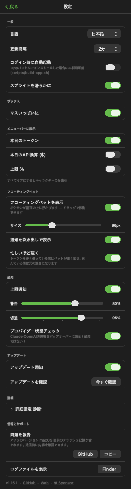
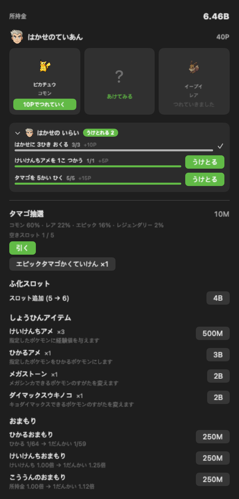

<div align="center">


# PokeDexBar

**あなたのAIコーディングトークンを、ポケモンに — メニューバーで。**

[](https://github.com/donky-ey/PokeDexBar/releases)
[](https://www.apple.com/macos/)
[](https://swift.org)
[](#homebrew)
[](LICENSE)
[](https://github.com/sponsors/donky-ey)

[English](README.md) · [한국어](README.ko.md) · **日本語**

</div>

> **[PokeTokenBar](https://github.com/chattymin/PokeTokenBar) のフォーク**（MIT, © chattymin）。
> PokeDexBar はスプライトソースを [Pokémon Showdown](https://play.pokemonshowdown.com/sprites/) に切り替え、
> 第9世代まですべての世代に対応し、スプライトに EPX アンチエイリアシングを追加します。

PokeDexBar は、あなたがすでに使っている AI コーディングトークン（Claude Code・Codex・Gemini CLI・OpenCode・Hermes Agent・Cursor・Grok CLI）を、macOS メニューバーの中の **ポケモン経済** に変えます。最初にパートナーを選ぶと、そこから使うトークンがそのまま通貨になります — 通貨でタマゴを引き、リアルタイムで孵化していくのを見守り、パートナーが経験値を貯めたら自分の手で進化させましょう。ゲームの下には正確な使用量トラッカーがあります — 今日の使用量・API換算、公式の5時間／週間上限をローカルログから直接読み取ります。

> トークン使用量はローカルの Claude Code・Codex・Gemini CLI・OpenCode・Hermes Agent・Cursor・Grok CLI データから直接読み取ります（`totalTokens` = input + output + cache、ローカル日付）— 外部 CLI 不要。非公式・非商用のポケモンファンプロジェクトです — [ライセンス & 免責](#ライセンス--免責) を参照。

## なぜ

- **開くのが楽しい使用量トラッカー。** 使用量がタマゴ抽選の通貨になり、図鑑を埋め、個体でいっぱいのボックスを育てます。色違い1匹が、また開く理由になります。
- 今日のトークン使用量とAPI換算を一目で — ダッシュボードもブラウザタブも不要。
- 公式の **5時間 / 週間** 上限をリセットのカウントダウンとともに追跡し、現在の burn rate でいつ到達するかを予測します。

<div align="center">

</div>

## しくみ

1. 🎮 **パートナーを選ぶ。** 初回起動時、第1〜9世代の進化前ポケモン27匹から1匹を選びます（色違いはありません）— それがあなたのパートナーになります。
2. 🪙 **いつも通りコーディング。** Claude Code・Codex・Gemini CLI・OpenCode・Hermes Agent・Cursor・Grok CLI で使うトークンがそのまま通貨になり、同時にパートナーの経験値も増えます — 追加の操作は不要です。
3. 🥚 **タマゴを引く。** **ショップ**で通貨を払うと、等級がランダムに決まったタマゴがもらえます — コモン60%・レア22%・エピック15%・レジェンダリー3%、選ぶことはできません。引いた瞬間、短い演出がまず流れます — 白い炸裂は必ず起き、レアなら水色がもう一段、エピックなら紫がもう一段、レジェンダリーならきらめくオレンジまでもう一段 — 何回はじけたかがそのまま等級なので、結果の文字を見る前にわかります。最大3個まで同時に温められ、スロットを買えば6個まで拡張できます。
4. 🐣 **リアルタイムで孵化。** コモンは30分、レアは2時間、エピックは6時間、レジェンダリーは24時間で準備完了 — アプリを閉じていても進む実時間で、準備ができると通知が一度届きます。準備ができてもタマゴが勝手に孵るわけではありません — ヒビが入ったままスロットに残り、**かくにん** をタップしてはじめて [PokéAPI](https://pokeapi.co/) の実際の進化データを持つ進化前（ベース）の種が生まれ、25種類のせいかくがひとつ決まり — ごくまれな偶然で **✨ 色違い** が生まれます。リージョンフォームを持つ種は20%の確率でアローラ・ガラル・ヒスイ・パルデアの姿で生まれ、その個体は一生その姿のままです。
5. ⚡ **自分の手で進化させる。** ポケモンは原作の6つのせいちょうカーブにそってLv.1から100までそだち、**原作と同じレベルで進化**します — ヒトカゲは16でリザードになります。コーディング（または経験値アメ）でレベルを上げ、準備ができたらタップして進化させましょう — 分岐する進化ラインは自分で行き先を選べます。リージョンフォームは進化先も変えます — ガラルのニャースはニャイキングに、カントーのニャースはペルシアンに進化します。レベルだけでは足りないこともあります: 56の分岐は進化の石を、25種は通信交換を要求しますが、交換相手のいないこのアプリでは **つながりのヒモ**、またはその交換で持たせる道具（メタルコートなど）が代わりになります。残りは共に過ごした時間を見ます。**それらの道具は売っていません。** リボンをつけたパートナーが *自分に* 必要なものをもってきて、一度手に入れるとなくならないので、以降のすべての個体に使えます。
6. 📖 **ふたつのコレクションを埋める。** **図鑑** はこれまでに孵化させたすべての種を1番から1025番まで記録します（未発見はシルエット）。**ボックス** は固定 6×5 マスの箱をページ送りで見る仕組みです — あたらしく手に入れた子はいちばん後ろにつき、**じぶんでせいりするまで**マスは動きません。ヘッダーの**せいり**ボタンがレベル・ランク・図鑑番号・色違い・リボンでいちど並べかえ、手にいれた順にすればもとにもどります。マスごとのラベルはなく、スプライト本体と枠、隅のマークがパートナー・色違い・リボン・進化可能かを代わりに伝えます。タップすると詳細画面でパートナー設定・アメを与える・進化・フォーム変更がすべてできます。重複はごく普通のことで、個体ごとに経験値と進化状態を別々に持つので、コイキングとギャラドスを同時に持つこともできます。

## ツアー

<table>
<tr>
<td width="45%" align="center"></td>
<td width="55%" valign="middle">
<h3>🐾 デスクトップに置く</h3>
パートナーをメニューバーからデスクトップへ、48〜192px の好きなサイズで。ホバーで今日の使用量、クリックでポップオーバー、右クリックでメニュー、ドラッグで自由に移動 — 上限アラートはペットの上に吹き出しでも表示されます。
</td>
</tr>
<tr>
<td width="55%" valign="middle">
<h3>メニューバーの相棒</h3>
動く Gen-V スプライトが今日のトークン合計（compact、例：<code>200.7M</code>）の隣に住んでいます。今日のAPI換算（<code>$</code>）や公式上限 <code>%</code> を追加しても、すべてオフにしてキャラクターだけにしても。
</td>
<td width="45%" align="center"></td>
</tr>
<tr>
<td width="45%" align="center"></td>
<td width="55%" valign="middle">
<h3>あたたかい子がボックスにいるとタマゴが早く孵ります</h3>
ほのおのからだ・マグマのよろい・じょうききかんは原作でふ化を半分にしてくれます。その特性を持つ23種がここでも同じ働きをします。<b>ボックスにいるだけ</b>でよく、そばに置く必要はありません。すでにふ化中だったタマゴは手に入れた瞬間に残り時間が半分になり、そのあとに引くタマゴは最初から半分です。だれのおかげかはふ化の行が教えてくれます。
</td>
</tr>
<tr>
<td width="55%" valign="middle">
<h3>これ以上しんかしないポケモンがタマゴをもってきます</h3>
そばにいる子が<b>じぶんのラインのタマゴ</b>をためます — リザードンはヒトカゲのタマゴをもってくるので、とばした前のすがたも図鑑にうめられます。けいけんちとは<b>べつのメーター</b>なので、しんかしてもタマゴのすすみぐあいはへりません。ホーム画面でたまっていくのを見まもり、いっぱいになるとタマゴがゆれ、おすとすぐ下のふ化スロットに入ります。うけとるまでそこで止まるので、タマゴがいくつもたまることはありません。
</td>
<td width="45%" align="center"></td>
</tr>
<tr>
<td width="45%" align="center"></td>
<td width="55%" valign="middle">
<h3>レベル、原作のやりかたで</h3>
経験値はもう「使ったトークンの数」ではありません。ポケモンごとに原作の6つのせいちょうカーブのひとつをもち、Lv.1から100までそのカーブにそってそだちます — だから<b>slow</b>の伝説はキャタピーより本当に時間がかかります。進化も原作どおり — ヒトカゲは16、リザードは36。とくべつなわざをおぼえる、夜に道具をもつ、パーティに仲間がいる、といった条件は、このアプリが実際にさしだせるものに置きかえてあります。
</td>
</tr>
<tr>
<td width="45%" align="center"></td>
<td width="55%" valign="middle">
<h3>育てない子ははかせにおくります</h3>
けっきょく育てないポケモンははかせにおくって、けんきゅうポイントをもらえます — <b>育てた子ほど高く</b>つくので、整理するのは自然と手をつけなかった重複になります。ポイントは別のつうかで、タマゴは買えませんし、トークンでははかせと取引できません。はかせは毎日3ひきをていあんし、<b>図鑑にいない種をすこし多め</b>にえらんできます。なにかを全部見てからえらべます。ボックスで何びきかまとめてえらぶこともできます — 色違いや伝説がまざっていると名前でよびかけ、もういちど確認します。
</td>
</tr>
<tr>
<td width="55%" valign="middle">
<h3>きょうの3ひきはふせられて とどきます</h3>
ていあんはふせられた状態でとどき、<b>1まいずつめくって</b>いきます — カードはその場でひらき、ランクにおうじて輪がひろがり色がこくなります（タマゴがかえるときと同じ色のはしごです）。ひらくまではなにももれません。色違いがまとう金枠さえもです。そして<b>この3ひきはあなたのもの</b>です — セーブごとにべつべつにふるようになったので、はかせがあなたにさしだす3ひきは、ほかの人にさしだす3ひきとちがいます。
</td>
<td width="45%" align="center"></td>
</tr>
<tr>
<td width="55%" valign="middle">
<h3>ボックスが手に負えなくなったらせいり</h3>
ボックスは手に入れた順にたまっていきますが、いつかは手に負えなくなります。<b>せいり</b>は一度おすだけで並べかえます — レベル・ランク・図鑑番号・色違い・リボンで、そしてその並びがそのまま残ります。あたらしく手に入れた子はあいかわらずいちばん後ろにつき、並べかえの位置に割りこまないので作業中にマスがずれることはありません。<b>手に入れた順</b>にすればもとどおりです。
</td>
<td width="45%" align="center"></td>
</tr>
<tr>
<td width="55%" valign="middle">
<h3>そばに置くことで変わる子たち</h3>
イルカマンは原作のとおり、出てくるときではなく<b>引っ込むとき</b>にマイティフォルムになります。そばに置いてから別の子に替えると変わっていて、もう一度替えると戻ります。テラパゴスはもっと単純で、そばにいるあいだはずっとテラスタルフォルム。テラスタルオーブがそこからもう一歩先へ連れていきます。
</td>
<td width="45%" align="center"></td>
</tr>
<tr>
<td width="45%" align="center"></td>
<td width="55%" valign="middle">
<h3>生まれたときから違う子たち</h3>
最初から違う姿で生まれてくる種がいます。アンノーンは26文字のひとつ、フラベベは5色の花のひとつ、カラナクシは東の海か西の海か — 孵化した瞬間に決まり、進化しても一生変わりません。番号の隣のバッジがどの子なのかを教えてくれます。
<br><br>
ビビヨンは原作の地域ルールをそのまま守ります。Mac の国設定が18種類のもようのうちどれで生まれうるかを決め、ときどき別の地域のもようが混ざります。ストリンダーは何も記録しません — 生まれたときのせいかくから姿が決まり、原作が分けた13種と12種のとおりです。
</td>
</tr>
<tr>
<td width="45%" align="center"></td>
<td width="55%" valign="middle">
<h3>✨ ごくまれな偶然、色違い</h3>
色違いはメニューバー・ホームカード・進化ライン・ボックスのどこでも専用カラーで表示され、進化しても維持されます。専用通知でその瞬間を見逃しません。
</td>
</tr>
<tr>
<td width="55%" valign="middle">
<h3>きらめきは一度だけ</h3>
色違いは原作と同じやり方で自分を知らせます — 姿を見せた瞬間、スプライトのまわりで金色の星が一度だけはじけます。タマゴから出たときに一度、ボックスで開くたびに一度。光り続けてしまうと特別さの合図ではなく背景の飾りになるからです。
</td>
<td width="45%" align="center"></td>
</tr>
<tr>
<td width="55%" valign="middle">
<h3>図鑑</h3>
<b>図鑑</b>は1番から1025番までの種チェックリストです — 孵化させるまではシルエットのまま。
</td>
<td width="45%" align="center"></td>
</tr>
<tr>
<td width="45%" align="center"></td>
<td width="55%" valign="middle">
<h3>すがたも別々に集まります</h3>
すがたが複数ある種 — リージョンフォームや、生まれたときに模様が決まる種 — は、図鑑の詳細画面の<b>すがたを みる</b>ボタンからその種だけの一覧が開きます。ビビヨンは模様が18種類、アンノーンは26種類。孵化させたすがたはカラーで表示され、残りはシルエットのままですが<b>名前は隠しません</b> — 何が残っているか見えてこそ集める気になるからです。種のカウンターは変わりません。どのすがたでも1匹いればそのマスは埋まります。
</td>
</tr>
<tr>
<td width="45%" align="center"></td>
<td width="55%" valign="middle">
<h3>ボックス</h3>
<b>ボックス</b>はリストではなく保管庫です — 固定 6×5 マスの箱をヘッダーの矢印でページ送りし、あたらしく手に入れた子はいちばん後ろにつき、<b>じぶんでせいりするまで</b>マスは動きません。ヘッダーの<b>せいり</b>ボタンがレベル・ランク・図鑑番号・色違い・リボンでいちど並べかえ、手にいれた順にすればもとにもどります。マスごとのラベルはなく、スプライトと枠、隅のマークがパートナー・色違い・リボン・進化可能かを代わりに伝えます。スプライトをマスいっぱいにトリミングするのはここだけです（設定 → ボックスでオフにできます） — ほかの画面ではキャンバスをそのまま残します、それがカビゴンをディグダより大きく見せているからです。重複はごく普通のことです。
</td>
</tr>
<tr>
<td width="55%" valign="middle">
<h3>個体ごとの詳細画面</h3>
タップすると等級・せいかく・共に使ったトークン・共に過ごした時間（経験値と違い進化しても減りません）、経験値バー、リボンの進み具合に加え、パートナー設定・アメを与える・進化・フォーム変更のボタンがある詳細画面が開きます。
</td>
<td width="45%" align="center"></td>
</tr>
<tr>
<td width="45%" align="center"></td>
<td width="55%" valign="middle">
<h3>⭐ お気に入りには★を</h3>
詳細画面で★をつけると、そのポケモンは はかせに送れません — ★を外すまで送るボタンの代わりに案内が出て、まとめて送るときも外されます。ボックスのマスの角に★が見え、<b>せいり</b>に<b>★を先に</b>が加わってお気に入りを前に集められます。ポケモンGOのお気に入りをそのまま持ってきました。
</td>
</tr>
<tr>
<td width="55%" valign="middle">
<h3>🎯 ずかんが応えてくれる</h3>
ずかん集めにミッションがつきました — 本家の構造そのまま: 登録数の節目(10種から1000種まで)ごとにほうび、世代をひとつ完成させると<b>でんせつタマゴかくていけん</b>にその世代の代表アイテム(メガシンカ世代はメガストーン、カントー・ガラルはダイマックスキノコ、のこりはひかるアメ)、そして1025種すべてをうめると<b>にじいろおまもり</b> — ひかるおまもりの完成形で、ひかる確率が1/32に。もとのおまもりがなくてももらえます。かくていけんはバッグに入り、ショップの抽選ボタンの下で無料・等級かくていの抽選としてつかえます。
</td>
<td width="45%" align="center"></td>
</tr>
<tr>
<td width="45%" align="center"></td>
<td width="55%" valign="middle">
<h3>🎖️ コレクションは物語を集める</h3>
ミッションの隣にテーマ別セットが21個 — でんせつの鳥、クローンの真実（ミュウ・ミュウツー・メタモン）、イーブイフレンズ、六世代ぶんのカセキ全部、こだいとみらいのパラドックスまで。メンバーは常にシルエットで見えるので、何が足りないかひと目でわかります。セットを完成させると行にメダルが灯り、ほうびを一度もらえます — 多くはけいけんちアメ、大きなセットはでんせつタマゴかくていけん。レジファミリーは特別です: 五本の柱を集めると<b>レジギガスそのものが目覚めて</b>ボックスに加わります — タマゴからは決して生まれない、このセットだけのほうびで、ひかる確率もいつも通り回ります。
</td>
</tr>
<tr>
<td width="55%" valign="middle">
<h3>📖 種ごとのずかん詳細画面</h3>
ずかんのマスをタップするとその種の詳細が開きます: スプライト・分類・タイプ・たかさ・おもさ、そして<b>登場したすべての世代のずかん説明</b>をチップで選んで読めます — ゲームに日本語説明がある世代は日本語で。所属するコレクションはメンバーの帯つきでその場に表示され、いま見ている種は枠で示されます。すがたの一覧もこの画面から開きます。
</td>
<td width="45%" align="center"></td>
</tr>
<tr>
<td width="45%" align="center"></td>
<td width="55%" valign="middle">
<h3>♀ ♂ すべてのポケモンに性別があります</h3>
性別はタマゴがかえるときにその種の実際の性別比で一度決まり、生涯変わりません — リージョンフォームと同じく進化しても受け継がれます。詳細画面の名前の横に表示されます。<b>98種にはメス専用のすがた</b>があり（ピカチュウの欠けたしっぽ、ヒポポタスの色）、本家が別フォームとして数える4種 — ニャオニクス・イエッサン・イダイトウ・パフュートン — はずかんのマスも別々に埋まります。性別で分かれる6つの進化も本家どおり: メスのユキワラシだけがユキメノコに、オスのラルトスだけがエルレイドになります。
</td>
</tr>
<tr>
<td width="45%" align="center"></td>
<td width="55%" valign="middle">
<h3>🔄 すがたが変わるポケモンが増えました</h3>
本家ではバトル中にしか起きないフォルムを、このアプリに実際にあるものへ移しました。<b>ギルガルド</b>はトークンを使っている間ブレードフォルムになり、手を止めるとシールドに戻ります。<b>モルペコ</b>は同じ signal を逆に読み、しばらく使わないとはらぺこもように。<b>ウッウ</b>はパートナーにするたびに獲物をくわえて帰ることがあり、<b>チェリム</b>は20%でポジティブフォルムになります。<b>メテノ</b>と<b>ヨワシ</b>はミミッキュ・コオリッポと同じく、デスクトップのペットを3回叩くと反応します。生まれつきすがたが分かれる種も11種増えました — バケッチャのサイズ、ミノムッチのミノ、イキリンコの羽色、そしてしんさくのヤバチャのような珍しいものまで。さらに Legends Z-A の<b>新しいメガシンカ24種</b>が、すでに持っているメガストーンで開きます。
</td>
</tr>
<tr>
<td width="45%" align="center"></td>
<td width="55%" valign="middle">
<h3>ランクがひと目でわかります</h3>
これまでランクを知るには個体を開く必要がありました。いまはボックスのマスのレベル表示がその色をまといます — タマゴ抽選の演出とふ化スロットが使っている色そのままなので、その子が出てきた殻がマスについているようなものです。コモンは無彩色のまま、レア・エピック・レジェンダリーだけ色がつきます。ほかは変わりません: 四隅はリボン・進化・★・選択のまま、枠は色違いとパートナーのままです。
</td>
</tr>
<tr>
<td width="45%" align="center"></td>
<td width="55%" valign="middle">
<h3>設定はお好みで</h3>
メニューバー表示項目、更新間隔（1–15分／手動）、ログイン時に起動、上限セクションだけを隠す Keychain オフ、警告／危険の閾値つき上限通知、孵化・進化の通知。<b>韓国語／英語／日本語</b>の UI とポケモン名を完備。
</td>
</tr>
<tr>
<td width="55%" valign="middle">
<h3>🥚 時計が育て、孵すのは自分</h3>
最大3個（スロットを買えば6個）まで同時に引けて、等級ごとに殻の色と斑点の数が違うので、何が育っているか一目でわかります。それぞれが実時間のタイマーでカウントダウンします — コモンは30分、レジェンダリーは24時間まで — 席を外していてもホームでリアルタイムに進み、準備ができると通知がひとつ届きます。そのあとはヒビの入ったままスロットで待っていて、かくにんをタップするとタマゴがゆれて割れ、その場からポケモンが飛び出します。
</td>
<td width="45%" align="center"></td>
</tr>
<tr>
<td width="45%" align="center"></td>
<td width="55%" valign="middle">
<h3>🛒 経済のためのショップ</h3>
これまで使ったトークンがそのまま通貨です — 1,000万でタマゴを引き、確率はボタンにそのまま表示され、ふ化スロットを3個から6個まで拡張し、<b>けいけんちアメ</b> でポケモンを育てたり <b>ひかるアメ</b> でそのまま色違いにしたり、孵化の色違い確率を1/64から1/48へ永続的に上げる <b>光るお守り</b>、トークンとアメで得られる経験値を2倍にする <b>経験値のお守り</b>、トークンで得られる所持金を1.5倍にする <b>こううんのおまもり</b> を購入できます。個体の詳細画面から <b>メガストーン</b> や <b>ダイマックスウキノコ</b> を使うと、80種類のフォームのひとつに姿を変えられます。進化の道具とフォルムの道具は意図的に売っていません — それはパートナーがもってきます。
</td>
</tr>
<tr>
<td width="55%" valign="middle">
<h3>🎗️ リボンは時間をアメと道具に変える</h3>
同じポケモンを長くパートナーとして連れていると、リボンがつきます — 1日できずな、1週間でしんらい、1か月でつながり、3か月でしょうがい、それぞれ専用バッジ付きです。リボンはそのポケモン自身を強化するのではなく、経験値アメ1個に必要なトークンを減らします（1億5000万 → 2000万） — そのアメはパートナーだけでなく、ボックスのどの個体にでも与えられます。
</td>
<td width="45%" align="center"></td>
</tr>
<tr>
<td width="45%" align="center"></td>
<td width="55%" valign="middle">
<h3>🎒 集めたものを見るバッグ</h3>
ショップが売るのは7種類だけ。残り105種はパートナーがもってくる以外に手に入らないので、持ち物を見る場所が <b>バッグ</b> です — しょうひんアイテムは個数つき、おまもりは所持表示、そして <b>進化の道具41種</b>・<b>フォルムの道具64種</b> はどこまで集めたかを進捗で見せます。ここでは使いません: どの道具も特定のポケモンに使うものなので、そのポケモンの詳細画面で使います。
</td>
</tr>
</table>

## そのほかにも

- **インタラクティブなフローティングペット** — ホバーで今日の使用量、クリックでメイン画面、右クリックでメニュー。上限アラートは吹き出しでも表示。**トークンを多く使っている間は速く動き**、休んでいる間は元の速さです（設定・きどう時オン）。
- **サービス別タブ** — Claude Code・Codex・Gemini CLI・OpenCode・Hermes Agent・Cursor・Grok CLI のうち2つ以上が検出されると、小さなタブでサービス別の詳細を切替（今日の合計は合算のまま）。
- **公式の上限** — Claude・Codex の5時間／週間使用率とリセットのカウントダウンを、今日の数字のすぐ下に。
- **消費予測** — 現在の5時間ウィンドウが100%に達する時刻を予測。
- **アプリ内アップデート** — ワンクリックの更新確認、設定に現在のバージョンを表示。
- **メガシンカ & キョダイマックス** — メガストーンやダイマックスウキノコで、指定したポケモンを80種類のフォームのひとつに変えます（リザードンのようにメガフォームが2つある種はX/Y両方を用意）。元の姿に戻すのは無料で、進化するとフォームは解除されます。
- **フォルム86種を追加** — アルセウスのプレート17枚とシルヴァディのメモリ17個、ロトムの家電、ゲノセクトのカセット、オーガポンのお面、ピカチュウのコスプレ・キャップ15種、そしてギラティナ・オリジンからゲンシグラードンまでの伝説の変身。フォルムは進化の鏡像です — 進化は種が変わって戻せませんが、フォルムは同じ個体が別のものをまとっただけなので、いつでも戻せて道具もなくなりません。
- **合体** — キュレム ブラック/ホワイト、ネクロズマのたそがれのたてがみ/あかつきのつばさ、バドレックスの2つの騎乗形態は、相手のポケモンがボックスにいる必要があります。相手は消えません: 取り込んでしまうと、戻せるはずのフォルムが戻せなくなります。
- **進化条件** — 56の分岐は石を、25種は通信交換で持たせる道具を要求し、残りは共に過ごした時間を見ます。どれも売っていません — リボンをつけたパートナーが必要なものをもってきて、道具はなくならないので、最初のほのおのいしがその後すべてのロコンに使えます。
- **バッグ** — ショップが売る7種類ではなく、集めた105種を見る場所。進化の道具41種・フォルムの道具64種のコレクション状況も一緒に見えます。
- **「もってきました！」** — パートナーが何かを見つけるとホームにカードが出て、タップして一つずつ確認します。確認が遅れても損はありません — 採取はトークンで回るので、見ていたかどうかに関わらず働いた分だけ貯まります。
- **リージョンフォーム** — アローラ・ガラル・ヒスイ・パルデアの姿は該当する種が孵化する際に20%の確率で現れ、その個体は一生その姿のままで、進化先が変わることもあります。メガシンカ・キョダイマックスはリージョンフォームには使えません。
- **リボン** — 同じポケモンを1日・1週間・1か月・3か月パートナーとして連れていると、それぞれきずな・しんらい・つながり・しょうがいのリボンがつき、リボンごとに専用バッジがあります。段階が上がるほど経験値アメ1個に必要なトークンが減り（1億5000万 → 2000万）、そのアメはパートナーだけでなくボックスのどの個体にでも与えられます。
- **原因を特定できるクラッシュ報告** — アプリが予期せず終了した場合、直前の20件の操作（どのポケモンを開いたか、どのタブにいたか）を保存し、次にポップオーバーを開いたときにその内容を含む GitHub Issue の作成を案内します。ホームディレクトリのパスは削除され、セーブデータは含まれず、ご自身で送信を押すまで何も送信されません。
- **セーブの整合性チェック** — セーブファイルを直接編集しても止められはしませんが、検知されます — セーブに改ざんの印が永久に残り、すべてのスプライトが上下逆さまに表示されますが、進行状況が失われることはありません。

## 対応ツール

| ツール | 集計範囲 | 公式の上限 |
|---|---|---|
| **Claude Code** | 今日 · 5時間ブロック · 週 · 月 | ✅ 5時間／週間 |
| **Codex** | 今日 · 週 · 月 | ✅ 5時間／週間 |
| **Gemini CLI** | 今日 · 週 · 月 | — |
| **OpenCode** | 今日 · 5時間ブロック · 週 · 月 | — |
| **Hermes Agent** | 今日 · 5時間ブロック · 週 · 月 | — |
| **Cursor** | 今日 · 5時間ブロック · 週 · 月 | — |
| **Grok CLI** | 今日 · 5時間ブロック · 週 · 月 | — |

すべてローカルから読み取り — 外部の使用量CLIは不要。ツール追加はプロバイダーファイル1つで完結します（[CONTRIBUTING.ja.md](CONTRIBUTING.ja.md) 参照）。

## インストール

### 必要条件

macOS 14+（Apple Silicon または Intel）。それだけ — トークン使用量はローカルの Claude Code・Codex・Gemini CLI・OpenCode・Hermes Agent・Cursor・Grok CLI データから直接読み取り、外部の使用量 CLI は不要です。

### Homebrew

```bash
brew install --cask donky-ey/tap/poke-dex-bar
```

ad-hoc／自己署名アプリのため、Cask インストール時に隔離属性を自動で除去します。

### 手動インストール（Homebrew なし）

Homebrew を使わない場合は、[最新リリース](https://github.com/donky-ey/PokeDexBar/releases/latest) から `PokeDexBar.zip` をダウンロードして展開し、`PokeDexBar.app` を `/Applications` にドラッグします。

このアプリは ad-hoc／自己署名（Apple Developer アカウントでの公証なし）のため、初回起動時に Gatekeeper が「開発元が未確認」の警告を表示します。次のいずれかで一度だけ解除してください。

- **Finder:** `PokeDexBar.app` を右クリック（または Control+クリック）→ **開く** → ダイアログで再度 **開く**。
- **ターミナル:** `xattr -dr com.apple.quarantine /Applications/PokeDexBar.app`

（Homebrew Cask は隔離属性を自動で除去するため、この手順は不要です。）

### ソースからビルド

```bash
swift build                  # デバッグ
swift test                   # ユニットテスト
./scripts/build-app.sh       # release → PokeDexBar.app → /Applications
```

## データソース

| ソース | 用途 | 備考 |
|---|---|---|
| `~/.claude/projects/**/*.jsonl` | Claude Code daily/blocks/weekly/monthly | 直接読み取り；メッセージ id で重複排除；増分キャッシュ |
| `~/.gemini/tmp/**/chats/*.json(l)` | Gemini CLI daily/monthly | セッションレコード（メッセージ別 `tokens`）；週間 = daily 合算 |
| `~/.codex/sessions/**/*.jsonl` | Codex daily/monthly | `token_count` イベント；週間 = daily 合算 |
| `~/.local/share/opencode/opencode.db` | OpenCode daily/blocks/weekly/monthly | SQLite 読み取り専用；レガシー `storage/message` JSON にも対応 |
| `~/.hermes/state.db` | Hermes Agent daily/blocks/weekly/monthly | SQLite 読み取り専用；セッショントークン合計と保存済みコスト |
| `~/Library/Application Support/Cursor/User/globalStorage/state.vscdb` | Cursor daily/blocks/weekly/monthly | SQLite 読み取り専用；`cursorDiskKV` バブルエントリの `tokenCount` |
| `~/.grok/sessions/**/updates.jsonl` | Grok CLI daily/blocks/weekly/monthly | `turn_completed` レコード（ターン単位の `usage`、サーバー報告のコスト）；`$GROK_HOME` を設定していればそのパス；サブエージェントのセッションは親ターンに合算済みのため除外 |
| Keychain / `~/.claude/.credentials.json` → `api.anthropic.com` | Claude 公式 5h/週間 % | 非公式 endpoint；Keychain は**更新ボタンを押した時のみ**読み取り — 自動更新では読みません |
| `codex app-server` | Codex 公式 5h/週間 % | ローカル子プロセス；アカウント snapshot のみ、モデル turn なし |
| [PokéAPI](https://pokeapi.co/) — `pokeapi.co`, `graphql.pokeapi.co` | ポケモンの種・進化データ | ランタイム取得；ローカルキャッシュ、バンドルしない |
| [Pokémon Showdown](https://play.pokemonshowdown.com/sprites/) — `play.pokemonshowdown.com` | ポケモンのスプライト（静止画・アニメーション、色違い、全世代） | ランタイム取得；Application Support にキャッシュ、バンドルしない |
| `raw.githubusercontent.com/PokeAPI/sprites` | アイテム・タマゴのスプライト | ランタイム取得；Application Support にキャッシュ、バンドルしない |
| `status.claude.com`, `status.openai.com` | プロバイダ障害バナー | statuspage の要約；表示専用 — 設定でオフにできます |
| `api.github.com` | アップデート確認 | 最新リリースのタグ；起動時とポップオーバーを開いた時 |

## プライバシー & 権限

- **オンデバイス。** トークン使用量はローカルの Claude Code・Codex・Gemini CLI・OpenCode・Hermes Agent・Cursor・Grok CLI データから直接読み取ります。使用量のアップロードやモデル turn の実行は行いません。
- **外部リクエスト。** 本アプリは完全オフラインではありません。8つのホストに接続します — `pokeapi.co`・`graphql.pokeapi.co`（種・進化データ）、`play.pokemonshowdown.com`（ポケモンのスプライト）、`raw.githubusercontent.com`（アイテム・タマゴのスプライト）、`api.anthropic.com`（Claude 公式の上限）、`status.claude.com`・`status.openai.com`（障害バナー — 設定でオフ可）、`api.github.com`（アップデート確認）。**いずれのリクエストにも使用量・トークン・プロンプト・プロジェクトのパスは含まれません** — 送られるのはリクエストそのものだけです。
- **Keychain（任意）。** Claude OAuth 資格情報は**更新ボタンを押した時のみ**読み取ります（設定、またはポップオーバーの上限行）。自動更新では Keychain に触れないためパスワードのプロンプトは表示されず、`~/.claude/.credentials.json` があればそちらから取得します。トークンはメモリ上にのみ保持し、**アプリ自身の Keychain 項目は作成しません。** トークンが期限切れになると、上限は更新するまで以前の値（stale）として表示されます。設定でオフにすると上限セクションが非表示になります。
- **ポケモンのアセット** はランタイムに取得します（種・進化データは PokéAPI、スプライトは Pokémon Showdown から）。`~/Library/Application Support/PokeDexBar/` にのみキャッシュされます。アプリのバイナリおよびリリース成果物にポケモンのアセットは含まれません。

## コントリビューター

大小を問わずあらゆる貢献を歓迎します — ビルド・テスト・プルリクエストの方法は [CONTRIBUTING.ja.md](CONTRIBUTING.ja.md) をご覧ください。

[](https://github.com/donky-ey/PokeDexBar/graphs/contributors)

## ライセンス & 免責

**MIT** — [LICENSE](LICENSE) を参照。MIT は本プロジェクトの**オリジナルソースコードのみ**を対象とし、アプリを通じてアクセスされる第三者の商標・アートワーク・データに関する権利を付与するものではありません。

PokeDexBar は**非公式・非商用のファンプロジェクト**です。**任天堂、ゲームフリーク、クリーチャーズ、株式会社ポケモンとの提携・推奨・後援・承認はありません。**「ポケモン（Pokémon）」および関連する名称・キャラクター・画像は、各権利者の商標および著作物であり、本プロジェクトはポケモンの知的財産に対する所有権や権利を一切主張しません。

- **アプリのバイナリおよびリリース成果物にポケモンのアセットは含まれません。** ポケモンの種・進化データは、公開されている [PokéAPI](https://pokeapi.co) から、スプライトは [Pokémon Showdown](https://play.pokemonshowdown.com/sprites/)(アニメーション・色違い、全世代)から**実行時に**取得され、ユーザーの端末にローカルキャッシュされます。スプライト画像の権利は各権利者に帰属します。
- 本リポジトリのドキュメント（スクリーンショット/GIF）に表示されるポケモンの画像は、アプリの機能を説明する目的でのみ使用されています。
- 本アプリは**個人的・非商用の利用に限り**無償で提供されます。
- 権利者の方で本プロジェクトに懸念がある場合は、Issue を作成するかメンテナーまでご連絡ください。速やかに対応いたします。

*本プロジェクトは、いかなる保証もなく「現状のまま」提供されます。本免責事項は法的助言ではありません。*
