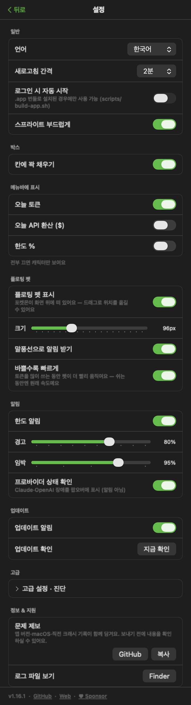
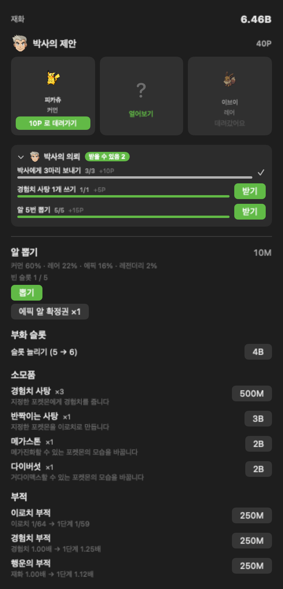

<div align="center">


# PokeDexBar

**당신의 AI 코딩 토큰을 포켓몬으로 — 메뉴바에서.**

[](https://github.com/donky-ey/PokeDexBar/releases)
[](https://www.apple.com/macos/)
[](https://swift.org)
[](#homebrew)
[](LICENSE)
[](https://github.com/sponsors/donky-ey)

[English](README.md) · **한국어** · [日本語](README.ja.md)

</div>

> **[PokeTokenBar](https://github.com/chattymin/PokeTokenBar)의 포크** (MIT, © chattymin).
> PokeDexBar는 스프라이트 소스를 [Pokémon Showdown](https://play.pokemonshowdown.com/sprites/)으로 교체해
> 9세대까지 모든 세대를 지원하며, 스프라이트에 EPX 안티앨리어싱을 추가합니다.

PokeDexBar는 당신이 이미 태우고 있는 AI 코딩 토큰(Claude Code · Codex · Gemini CLI · OpenCode · Hermes Agent · Cursor · Grok CLI)을 macOS 메뉴바 속 **포켓몬 경제**로 바꿔줍니다. 스타터를 고르면 그때부터 쓰는 토큰이 곧 재화가 됩니다 — 재화로 알을 뽑고, 실시간으로 부화하는 걸 지켜보고, 파트너가 경험치를 모으면 직접 눌러 진화시키세요. 게임 아래에는 정확한 사용량 트래커가 있습니다 — 오늘의 사용량·API 환산, 공식 5시간/주간 한도를 로컬 로그에서 직접 읽습니다.

> 토큰 사용량은 로컬 Claude Code·Codex·Gemini CLI·OpenCode·Hermes Agent·Cursor·Grok CLI 데이터에서 직접 읽습니다(`totalTokens` = input + output + cache, 로컬 날짜) — 외부 CLI 불필요. 비공식·비상업 포켓몬 팬 프로젝트 — [라이선스 & 면책](#라이선스--면책) 참고.

## 왜

- **열어보는 게 즐거운 사용량 트래커.** 사용량이 알 뽑기 재화가 되어 도감을 채우고 개체가 가득한 박스를 키웁니다. 이로치 한 마리가 다시 열어볼 이유가 됩니다.
- 오늘의 토큰 사용량과 API 환산을 한눈에 — 대시보드도, 브라우저 탭도 필요 없이.
- 공식 **5시간 / 주간** 한도를 리셋 카운트다운과 함께 추적하고, 현재 burn rate로 언제 도달할지 예측합니다.

<div align="center">

</div>

## 어떻게 자라나요

1. 🎮 **스타터를 고르세요.** 첫 실행에 1~9세대 1단계 포켓몬 27마리 중 하나를 고릅니다(이로치는 없어요) — 그 아이가 파트너가 됩니다.
2. 🪙 **평소처럼 코딩하세요.** Claude Code·Codex·Gemini CLI·OpenCode·Hermes Agent·Cursor·Grok CLI에서 태우는 토큰이 그대로 재화가 되고, 동시에 파트너의 경험치도 채웁니다 — 따로 돌릴 건 없어요.
3. 🥚 **알을 뽑으세요.** **상점**에서 재화를 내면 등급이 무작위로 정해진 알을 받습니다 — 커먼 60% · 레어 22% · 에픽 15% · 레전더리 3%, 고를 순 없어요. 뽑는 순간 짧은 연출이 먼저 재생됩니다 — 흰색 폭발은 항상 뜨고, 레어면 하늘색이 한 번 더, 에픽이면 보라색이 한 번 더, 레전더리면 반짝이는 주황색까지 한 번 더 — 폭발이 몇 번 터지는지가 곧 등급이라 결과 글자를 보기 전에 이미 알 수 있어요. 최대 3개가 동시에 부화 중일 수 있고, 슬롯을 사면 6개까지 늘릴 수 있습니다.
4. 🐣 **실시간으로 부화.** 커먼은 30분, 레어는 2시간, 에픽은 6시간, 레전더리는 24시간 — 앱을 꺼 둬도 흐르는 실제 시계 기준이고, 준비되면 알림이 한 번 옵니다. 다 익었다고 알이 저절로 깨지는 건 아니에요 — 슬롯에 금이 간 채로 남아 있다가, **확인**을 눌러야 [PokéAPI](https://pokeapi.co/)의 실제 진화 데이터를 가진 진화 전(베이스) 종으로 태어나고 25종 성격 중 하나가 정해지며 — 아주 드문 우연으론 **✨ 이로치**로 태어납니다. 지방 모습이 있는 종은 20% 확률로 알로라·가라르·히스이·팔데아 모습으로 태어나며, 그 개체는 평생 그 모습을 유지합니다.
5. ⚡ **직접 진화시키세요.** 포켓몬은 본가의 6가지 성장 곡선을 따라 1~100레벨로 자라고, **본가와 같은 레벨에 진화**합니다 — 파이리는 16레벨에 리자드가 돼요. 코딩(또는 경험치 사탕)으로 레벨을 올리고, 준비되면 눌러서 진화시키세요 — 분기가 있는 라인은 직접 갈 길을 고를 수 있습니다. 지방 모습은 진화 갈래도 바꿉니다 — 가라르 나옹은 나이킹으로, 관동 나옹은 페르시온으로 진화해요. 레벨만으로는 안 되는 경우도 있습니다: 56개 갈래는 진화의 돌을, 25종은 통신교환을 요구하는데 교환 상대가 없는 이 앱에서는 **연결의 끈**이나 그때 지녀야 할 물건(금속코트 등)이 대신합니다. 나머지는 함께한 시간을 봅니다. **그 도구들은 팔지 않아요.** 리본을 단 파트너가 *자기에게* 필요한 것을 물어 오고, 한 번 얻으면 없어지지 않아 이후 모든 개체에게 쓸 수 있습니다.
6. 📖 **두 가지 컬렉션을 채우세요.** **도감**은 지금까지 부화시킨 모든 종을 1번부터 1025번까지 기록합니다(못 본 종은 실루엣). **박스**는 고정 6×5칸 상자를 페이지로 넘겨 보는 방식이에요 — 새로 얻은 아이는 맨 뒤에 붙고, **직접 정리하기 전까지는** 칸이 안 움직입니다. 헤더의 **정리** 버튼이 레벨·등급·도감번호·이로치·리본 기준으로 한 번 다시 배열하고, 획득순으로 정리하면 원래대로 돌아옵니다. 칸마다 이름표는 없고, 스프라이트 자체와 테두리, 모서리 표시가 파트너·이로치·리본·진화 가능 여부를 대신 말해줘요. 칸을 누르면 상세 화면에서 파트너 지정·사탕 먹이기·진화·폼 변경을 모두 할 수 있습니다. 중복은 자연스러운 일이고, 개체마다 각자의 경험치와 진화 상태를 가져서 코이킹과 갸라도스를 동시에 가질 수도 있어요.

## 둘러보기

<table>
<tr>
<td width="45%" align="center"></td>
<td width="55%" valign="middle">
<h3>🐾 바탕화면에 두기</h3>
파트너를 메뉴바 밖 바탕화면으로 꺼내 48~192px 원하는 크기로 둘 수 있어요. 호버하면 오늘 사용량, 클릭하면 팝오버, 우클릭하면 메뉴, 드래그로 위치 이동 — 한도 알림은 펫 위 말풍선으로도 떠요.
</td>
</tr>
<tr>
<td width="55%" valign="middle">
<h3>메뉴바 속 파트너</h3>
움직이는 Gen-V 스프라이트가 오늘 토큰 합계(compact, 예: <code>200.7M</code>) 옆에 삽니다. 오늘 API 환산(<code>$</code>)이나 공식 한도 <code>%</code> 를 더하거나 — 전부 꺼서 캐릭터만 남길 수도 있어요.
</td>
<td width="45%" align="center"></td>
</tr>
<tr>
<td width="45%" align="center"></td>
<td width="55%" valign="middle">
<h3>따뜻한 아이가 박스에 있으면 알이 빨리 깨요</h3>
불꽃몸·마그마의무장·증기기관은 원작에서 부화를 절반으로 줄여 주고, 그 특성을 가진 23종이 여기서도 같은 일을 합니다. <b>박스에 있기만 하면</b> 되고 곁에 둘 필요는 없어요. 이미 부화 중이던 알은 얻는 순간 남은 시간이 절반이 되고, 그 뒤에 뽑는 알은 처음부터 절반으로 시작합니다. 누구 덕인지는 부화 줄이 알려줘요.
</td>
</tr>
<tr>
<td width="55%" valign="middle">
<h3>더 될 것이 없는 아이가 알을 가져와요</h3>
곁에 둔 아이가 <b>자기 라인의 알</b>을 채웁니다 — 리자몽은 파이리 알을 가져오니, 건너뛴 앞 단계를 도감에 메울 수 있어요. 경험치와 <b>별개의 계량기</b>라 진화해도 알 진행분이 깎이지 않습니다. 홈 화면에서 차오르는 걸 지켜보다가, 꽉 차면 알이 흔들리고 그걸 누르면 바로 아래 부화 칸에 들어갑니다. 받기 전까지는 거기서 멈춰 있어서 알이 두 개씩 밀리는 일은 없어요.
</td>
<td width="45%" align="center"></td>
</tr>
<tr>
<td width="45%" align="center"></td>
<td width="55%" valign="middle">
<h3>레벨, 본가 방식 그대로</h3>
경험치가 더 이상 쓴 토큰 수가 아닙니다. 포켓몬마다 본가의 6가지 성장 곡선 중 하나를 갖고 1레벨부터 100레벨까지 그 곡선을 따라 자라요 — 그래서 <b>slow</b> 곡선인 전설은 캐터피보다 실제로 오래 걸립니다. 진화도 본가를 따릅니다 — 파이리 16, 리자드 36. 특정 기술을 배워야 하거나, 밤에 도구를 들어야 하거나, 파티에 동행이 필요한 진화는 이 앱이 실제로 내줄 수 있는 조건으로 옮겨 놨어요.
</td>
</tr>
<tr>
<td width="45%" align="center"></td>
<td width="55%" valign="middle">
<h3>안 키울 아이는 박사에게 보내요</h3>
끝내 안 키울 포켓몬은 박사에게 보내고 연구 포인트를 받습니다 — <b>키운 아이일수록 값이 나가서</b>, 정리 대상이 자연히 손 안 댄 중복이 돼요. 포인트는 별개 재화라 알을 못 사고, 토큰으로는 박사와 거래할 수 없어요. 박사는 매일 세 마리를 내미는데 <b>도감에 없는 종을 좀 더 자주</b> 골라 오고, 무엇인지 다 보고 나서 고르면 됩니다. 박스에서 여러 마리를 한 번에 고를 수도 있어요 — 이로치나 전설이 섞이면 이름으로 불러 주고 한 번 더 물어봅니다.
</td>
</tr>
<tr>
<td width="55%" valign="middle">
<h3>오늘의 셋은 가려진 채로 와요</h3>
제안은 덮인 채로 도착하고 <b>한 칸씩 뒤집어 봅니다</b> — 카드는 그 자리에서 열리고, 등급에 따라 고리가 넓어지고 색이 짙어져요(알이 깨질 때와 같은 색 사다리예요). 열기 전에는 아무것도 안 새요. 이로치가 두르는 금테마저도요. 그리고 <b>이 셋은 당신 것</b>이에요 — 이제 세이브마다 따로 굴리니까, 박사가 당신에게 내미는 셋은 다른 사람에게 내미는 셋과 달라요.
</td>
<td width="45%" align="center"></td>
</tr>
<tr>
<td width="55%" valign="middle">
<h3>박스가 감당이 안 될 때 정리하세요</h3>
박스는 들어온 순서대로 쌓이는데, 그게 언젠가는 감당이 안 됩니다. <b>정리</b>는 한 번 눌러 다시 배열해요 — 레벨·등급·도감번호·이로치·리본 기준으로, 그리고 그 배치가 그대로 남습니다. 새로 얻은 아이는 여전히 맨 뒤에 붙지 정렬 자리에 끼어들지 않아서 일하는 동안 칸이 밀리지 않고, <b>획득순</b>으로 정리하면 원래대로 정확히 돌아옵니다.
</td>
<td width="45%" align="center"></td>
</tr>
<tr>
<td width="55%" valign="middle">
<h3>곁에 두는 것으로 바뀌는 아이들</h3>
돌핀맨은 원작 그대로 — 나올 때가 아니라 <b>물러날 때</b> 마이티폼이 됩니다. 곁에 뒀다가 다른 아이로 바꾸면 그때 달라져 있고, 또 바꾸면 되돌아옵니다. 테라파고스는 더 단순해요. 곁에 있는 동안 계속 테라스탈 폼이고, 테라스탈 오브가 거기서 한 걸음 더 데려갑니다.
</td>
<td width="45%" align="center"></td>
</tr>
<tr>
<td width="45%" align="center"></td>
<td width="55%" valign="middle">
<h3>태어날 때부터 다른 아이들</h3>
어떤 종은 처음부터 다르게 나옵니다. 안농은 26글자 중 하나, 플라베베는 다섯 꽃 색 중 하나, 베가베가는 동쪽바다와 서쪽바다 중 하나 — 부화하는 순간 정해져 평생 가고, 진화해도 이어집니다. 번호 옆 배지가 어떤 아이인지 말해줘요.
<br><br>
비비용은 원작의 지역 규칙을 그대로 따릅니다. 맥의 국가 설정이 18가지 무늬 중 어떤 것으로 태어날 수 있는지를 정하고, 가끔 다른 지역에서 온 무늬가 섞여요. 스트린더는 아무것도 기록하지 않습니다 — 태어날 때 정해진 성격에서 모습이 나오고, 원작이 가른 13종과 12종 그대로입니다.
</td>
</tr>
<tr>
<td width="45%" align="center"></td>
<td width="55%" valign="middle">
<h3>✨ 아주 드문 우연, 이로치</h3>
이로치는 메뉴바·홈 카드·진화 라인·박스 어디서나 전용 색으로 표시되고, 진화를 거쳐도 유지됩니다. 전용 알림이 그 순간을 놓치지 않게 해줘요.
</td>
</tr>
<tr>
<td width="55%" valign="middle">
<h3>반짝임은 한 번만</h3>
이로치는 원작이 하는 방식 그대로 자기를 드러냅니다 — 등장하는 순간 스프라이트 둘레에서 금색 별이 한 번 터져요. 알에서 나올 때 한 번, 박스에서 열어볼 때마다 한 번. 계속 반짝이면 특별하다는 신호가 아니라 배경 장식이 되니까요.
</td>
<td width="45%" align="center"></td>
</tr>
<tr>
<td width="55%" valign="middle">
<h3>도감</h3>
<b>도감</b>은 1번부터 1025번까지 종을 체크하는 목록입니다 — 부화시키기 전엔 실루엣이에요.
</td>
<td width="45%" align="center"></td>
</tr>
<tr>
<td width="45%" align="center"></td>
<td width="55%" valign="middle">
<h3>모습도 따로 모읍니다</h3>
모습이 여럿인 종 — 지방 모습이거나, 태어날 때 무늬가 정해지는 종 — 은 도감 상세 화면의 <b>모습 보기</b> 버튼에서 그 종만의 목록이 열립니다. 비비용은 무늬가 18가지, 안농은 26가지입니다. 부화시킨 모습은 컬러로 나오고 나머지는 실루엣으로 남지만 <b>이름은 가리지 않습니다</b> — 무엇이 남았는지 보여야 모을 마음이 생기니까요. 종 카운터는 그대로입니다. 어떤 모습이든 하나면 그 칸은 채워집니다.
</td>
</tr>
<tr>
<td width="45%" align="center"></td>
<td width="55%" valign="middle">
<h3>박스</h3>
<b>박스</b>는 목록이 아니라 보관함이에요 — 고정 6×5칸 상자를 상단 화살표로 페이지 넘기며 보고, 새로 얻은 아이는 맨 뒤에 붙고, <b>직접 정리하기 전까지는</b> 칸이 안 움직입니다. 헤더의 <b>정리</b> 버튼이 레벨·등급·도감번호·이로치·리본 기준으로 한 번 다시 배열하고, 획득순으로 정리하면 원래대로 돌아옵니다. 칸마다 이름표는 없이 스프라이트와 테두리, 모서리 표시가 파트너·이로치·리본·진화 가능 여부를 대신 말해줘요. 여기서만 스프라이트를 칸에 꽉 채워 트리밍하고(설정 → 박스에서 끌 수 있어요), 다른 화면에서는 캔버스를 그대로 둡니다 — 잠만보가 디그다보다 커 보이는 건 그 캔버스 덕분이거든요. 중복은 완전히 자연스러운 일이에요.
</td>
</tr>
<tr>
<td width="55%" valign="middle">
<h3>개체별 상세 화면</h3>
칸을 누르면 등급·성격·함께 쓴 토큰·함께한 시간(경험치와 달리 진화해도 줄지 않아요), 경험치 바, 리본 진행도에 더해 파트너 지정·사탕 먹이기·진화·폼 변경 버튼이 있는 상세 화면이 열려요.
</td>
<td width="45%" align="center"></td>
</tr>
<tr>
<td width="45%" align="center"></td>
<td width="55%" valign="middle">
<h3>⭐ 아끼는 아이는 별표</h3>
상세 화면에서 별표를 누르면 그 포켓몬은 박사에게 보낼 수 없어요 — 별표를 해제하기 전까지 보내기 버튼 대신 안내가 뜨고, 여러 마리 보내기에서도 건너뛰어요. 박스 칸 모서리에 별이 보이고, <b>정리</b> 메뉴에 <b>별표 먼저</b> 정렬이 생겨 아끼는 아이들을 앞으로 모아 볼 수 있어요. 포켓몬 GO 의 즐겨찾기를 그대로 가져왔어요 — "내 것" 과 "보내지 마" 를 표시 하나로.
</td>
</tr>
<tr>
<td width="55%" valign="middle">
<h3>🎯 도감이 보답해요</h3>
도감 채우기에 미션이 붙었어요 — 본가의 구조 그대로: 등록 마릿수 고비(10종부터 1000종까지)마다 보상, 세대 하나를 완성하면 <b>레전더리 알 확정권</b> 위에 그 세대의 대표 아이템(메가진화 세대는 메가스톤, 관동·가라르는 다이버섯, 나머지는 반짝이는 사탕), 그리고 1025종 전부를 채우면 <b>무지개 부적</b> — 이로치 부적의 완성형으로 이로치 확률이 1/32이 되고, 기존 부적이 없어도 지급돼요. 확정권은 가방에 담겼다가 상점 뽑기 버튼 아래에서 무료·등급 확정 뽑기로 쓰여요.
</td>
<td width="45%" align="center"></td>
</tr>
<tr>
<td width="45%" align="center"></td>
<td width="55%" valign="middle">
<h3>🎖️ 컬렉션은 이야기를 모아요</h3>
미션 옆에 주제별 세트 21개가 있어요 — 전설의 새, 클론의 진실(뮤·뮤츠·메타몽), 이브이 프렌즈, 여섯 세대의 화석 전부, 고대와 미래의 패러독스까지. 구성원은 항상 실루엣으로 보여서 뭐가 빠졌는지 한눈에 알 수 있어요. 세트를 완성하면 줄에 메달이 켜지고 보상을 한 번 받아요 — 대부분은 경험치 사탕, 큰 세트는 레전더리 알 확정권. 레지 패밀리는 특별해요: 다섯 기둥을 모으면 <b>레지기가스가 직접 깨어나</b> 박스에 합류해요 — 알에서는 절대 나오지 않는 이 세트만의 보상이고, 이로치 확률도 그대로 굴러가요.
</td>
</tr>
<tr>
<td width="55%" valign="middle">
<h3>📖 종마다 도감 상세 화면</h3>
이제 도감 칸을 누르면 그 종의 상세가 열려요: 스프라이트·분류·타입·키·몸무게, 그리고 <b>등장한 모든 세대의 도감 설명</b>을 칩으로 골라 읽을 수 있어요 — 한국어 설명이 있는 세대는 한국어로 나와요. 속한 컬렉션이 있으면 구성원 띠와 함께 그 자리에서 보이고 지금 보는 종이 테두리로 표시돼요. 모습 목록도 이 화면에서 열려요.
</td>
<td width="45%" align="center"></td>
</tr>
<tr>
<td width="45%" align="center"></td>
<td width="55%" valign="middle">
<h3>♀ ♂ 모든 포켓몬에 성별이 있어요</h3>
성별은 알에서 깰 때 그 종의 실제 성비로 한 번 정해지고 평생 안 바뀌어요 — 지방 모습처럼 진화해도 이어집니다. 상세 화면 이름 옆에 보여요. <b>98종은 암컷 전용 그림이 있고</b>(피카츄의 파인 꼬리, 히포포타스의 색), 그중 본가가 별개 폼으로 세는 넷 — 냐오닉스·에써르·대쓰여너·퍼퓨돈 — 은 도감 칸도 따로 채워집니다. 성별로 갈리는 진화 여섯 갈래도 본가 그대로예요: 암컷 눈꼬마만 눈여아가 되고, 수컷 랄토스만 엘레이드가 됩니다.
</td>
</tr>
<tr>
<td width="45%" align="center"></td>
<td width="55%" valign="middle">
<h3>🔄 모습이 바뀌는 포켓몬이 늘었어요</h3>
원작에서 배틀 중에만 일어나는 폼을, 이 앱에 실제로 있는 것으로 옮겼어요. <b>킬가르도</b>는 토큰을 쓰는 동안 칼을 뽑고 손을 떼면 방패로 돌아가요. <b>모르페코</b>는 같은 신호를 반대로 읽어서, 한동안 안 쓰면 배고픈 모드가 됩니다. <b>윽우지</b>는 파트너로 지정할 때마다 먹이를 물고 올 수 있고, <b>체리꼬</b>는 20% 확률로 꽃이 펴요. <b>메테노</b>와 <b>약어리</b>는 따라큐·빙큐보처럼 바탕화면 펫을 세 번 두드리면 반응합니다. 태어날 때 모습이 갈리는 종도 11종 늘었어요 — 호바귀의 크기, 도롱충이의 도롱, 시비꼬의 깃털색, 그리고 진작 데인차 같은 희귀한 것까지. 여기에 Legends Z-A의 <b>신규 메가진화 24종</b>이 이미 가진 메가스톤으로 열립니다.
</td>
</tr>
<tr>
<td width="45%" align="center"></td>
<td width="55%" valign="middle">
<h3>설정에서 취향대로</h3>
메뉴바 표시 항목, 새로고침 간격(1–15분/수동), 로그인 시 자동 시작, 한도 섹션만 숨기는 Keychain 끄기, 경고/임박 임계값 한도 알림, 부화·진화 알림. <b>한국어/영어/일본어</b> UI·포켓몬 이름 완비.
</td>
</tr>
<tr>
<td width="55%" valign="middle">
<h3>🥚 시계가 익히면, 깨우는 건 나예요</h3>
최대 3개(슬롯을 사면 6개)를 동시에 뽑을 수 있고, 등급마다 껍질 색과 무늬 수가 달라 한눈에 뭐가 자라는 중인지 알 수 있어요. 각자 실제 시계로 부화 타이머가 흐릅니다 — 커먼은 30분, 레전더리는 24시간까지 — 자리를 비워도 홈에서 실시간으로 카운트다운되고, 준비되면 알림 하나로 알려줍니다. 그 뒤엔 슬롯에 금이 간 채로 기다리다가, 확인을 누르면 알이 흔들리다 터지고 그 자리에서 포켓몬이 나와요.
</td>
<td width="45%" align="center"></td>
</tr>
<tr>
<td width="45%" align="center"></td>
<td width="55%" valign="middle">
<h3>🛒 경제를 위한 상점</h3>
그동안 쓴 토큰이 곧 재화입니다 — 1,000만으로 알을 뽑고 확률은 버튼에 바로 표시되며, 부화 슬롯을 3개에서 6개까지 늘리고, <b>경험치 사탕</b>으로 포켓몬을 키우거나 <b>반짝이는 사탕</b>으로 바로 이로치를 만들거나, 부화 이로치 확률을 1/64에서 1/48로 영구히 올리는 <b>이로치 부적</b>, 토큰·경험치 사탕으로 얻는 경험치를 2배로 만드는 <b>경험치 부적</b>, 토큰으로 얻는 재화를 1.5배로 만드는 <b>행운의 부적</b>을 살 수 있어요. 개체 상세 화면에서 <b>메가스톤</b>이나 <b>다이버섯</b>을 쓰면 80종의 폼 중 하나로 모습을 바꿀 수 있어요. 진화 도구와 폼 도구는 일부러 안 팝니다 — 그건 파트너가 물어 와요.
</td>
</tr>
<tr>
<td width="55%" valign="middle">
<h3>🎗️ 리본, 시간을 사탕과 도구로</h3>
같은 포켓몬을 오래 파트너로 두면 리본을 얻어요 — 하루엔 인연, 일주일엔 신뢰, 한 달엔 유대, 석 달엔 반려, 단계마다 전용 배지가 붙습니다. 리본은 그 포켓몬 자체를 강화하지 않고, 경험치 사탕 하나가 나오는 데 필요한 토큰을 줄여줘요(1억 5천만 → 2천만) — 그 사탕은 파트너뿐 아니라 박스의 어느 개체에게나 먹일 수 있어요.
</td>
<td width="45%" align="center"></td>
</tr>
<tr>
<td width="45%" align="center"></td>
<td width="55%" valign="middle">
<h3>🎒 모아 온 것을 보는 가방</h3>
상점이 파는 건 일곱 가지뿐입니다. 나머지 105종은 오직 파트너가 물어 와야 생기므로, 가진 것을 보는 자리가 <b>가방</b>이에요 — 소모품은 개수와 함께, 부적은 보유 표시로, 그리고 <b>진화 도구 41종</b>·<b>폼 도구 64종</b>은 얼마나 모았는지 진행도로 보여줍니다. 여기서 쓰지는 않아요: 모든 도구는 특정 포켓몬에게 쓰는 것이라 그 포켓몬의 상세 화면에서 씁니다.
</td>
</tr>
</table>

## 이 밖에도

- **인터랙티브 플로팅 펫** — 호버로 오늘 사용량, 클릭으로 메인 창, 우클릭 메뉴; 한도 알림은 말풍선으로도 표시. **토큰을 많이 쓰는 동안에는 더 빨리 움직이고** 쉬는 동안엔 원래 속도예요(설정, 기본 켬).
- **서비스별 탭** — Claude Code·Codex·Gemini CLI·OpenCode·Hermes Agent·Cursor·Grok CLI 중 2개 이상 감지되면 작은 탭으로 상세를 서비스별 전환(오늘 합계는 통합 유지).
- **공식 한도** — Claude·Codex 5시간/주간 사용률 + 리셋 카운트다운을 오늘 숫자 바로 아래에.
- **소진 예측** — 현재 5시간 창이 100%에 도달할 시각 예측.
- **인앱 업데이트** — 원클릭 업데이트 확인, 설정에 현재 버전 표시.
- **메가진화 & 거다이맥스** — 메가스톤이나 다이버섯으로 지정한 포켓몬을 80종의 폼 중 하나로 바꿉니다(리자몽처럼 메가 폼이 둘인 종은 X/Y 모두 제공). 원래 모습으로 되돌리는 건 무료고, 진화하면 폼이 풀립니다.
- **폼 86종 추가** — 아르세우스의 플레이트 17장과 실버디의 메모리 17개, 로토무의 가전제품, 게노세크트의 카세트, 오거폰의 가면, 피카츄의 변장·모자 15종, 그리고 기라티나 오리진부터 원시 그란돈까지의 전설 변신. 폼은 진화의 거울상입니다 — 진화는 종이 바뀌어 못 되돌리지만, 폼은 같은 개체가 다른 것을 걸친 것이라 언제든 되돌아오고 도구도 없어지지 않습니다.
- **합체** — 큐레무 블랙/화이트, 네크로즈마의 황혼의 갈기/새벽의 날개, 버드렉스의 두 기수는 상대 포켓몬이 박스에 있어야 합니다. 상대는 사라지지 않아요: 먹어 버리면 되돌릴 수 있는 폼이 되돌릴 수 없게 됩니다.
- **진화 조건** — 56개 갈래는 돌을, 25종은 통신교환에 지녀야 할 물건을 요구하고, 나머지는 함께한 시간을 봅니다. 어느 것도 팔지 않아요 — 리본을 단 파트너가 필요한 것을 물어 오고, 도구는 없어지지 않으므로 처음 얻은 불꽃의돌이 이후 모든 식스테일에게 쓰입니다.
- **가방** — 상점이 파는 일곱 가지 말고, 모아 온 105종을 보는 자리. 진화 도구 41종·폼 도구 64종의 수집 현황이 함께 보입니다.
- **"물어 왔어요!"** — 파트너가 뭔가를 찾으면 홈에 카드가 뜨고, 눌러서 하나씩 확인합니다. 확인이 늦어도 손해는 없어요 — 채집은 토큰으로 돌기 때문에, 보고 있었는지와 무관하게 일한 만큼 쌓입니다.
- **지방 모습** — 알로라·가라르·히스이·팔데아 모습은 해당 종이 부화할 때 20% 확률로 나타나고, 그 개체는 평생 그 모습을 유지하며 진화 갈래가 달라지기도 합니다. 메가진화·거다이맥스는 지방 모습에는 적용되지 않아요.
- **리본** — 같은 포켓몬을 하루·일주일·한 달·석 달 동안 파트너로 두면 각각 인연·신뢰·유대·반려 리본을 달고, 리본마다 전용 배지가 있어요. 단계가 오를수록 경험치 사탕 하나가 나오는 데 필요한 토큰이 줄어들고(1억 5천만 → 2천만), 그 사탕은 파트너뿐 아니라 박스의 어느 개체에게나 먹일 수 있습니다.
- **원인을 짚어 주는 크래시 제보** — 앱이 예기치 않게 종료되면 직전에 하던 스무 가지(어떤 포켓몬을 열었는지, 어느 탭에 있었는지)를 남겨 두었다가, 다음에 팝오버를 열 때 그 내용을 담은 GitHub 이슈 작성을 권합니다. 홈 디렉터리 경로는 지워지고 세이브는 담기지 않으며, 직접 제출을 누르기 전에는 아무것도 전송되지 않습니다.
- **세이브 무결성 검사** — 세이브 파일을 직접 고치는 걸 막지는 않지만, 고치면 감지합니다 — 세이브에 조작 표시가 영구히 남고 모든 스프라이트가 위아래로 뒤집혀 보이지만, 진행 상황이 사라지지는 않아요.

## 지원 도구

| 도구 | 집계 범위 | 공식 한도 |
|---|---|---|
| **Claude Code** | 오늘 · 5시간 블록 · 주 · 월 | ✅ 5시간 / 주간 |
| **Codex** | 오늘 · 주 · 월 | ✅ 5시간 / 주간 |
| **Gemini CLI** | 오늘 · 주 · 월 | — |
| **OpenCode** | 오늘 · 5시간 블록 · 주 · 월 | — |
| **Hermes Agent** | 오늘 · 5시간 블록 · 주 · 월 | — |
| **Cursor** | 오늘 · 5시간 블록 · 주 · 월 | — |
| **Grok CLI** | 오늘 · 5시간 블록 · 주 · 월 | — |

모두 로컬에서 읽습니다 — 외부 사용량 CLI 불필요. 도구 추가는 프로바이더 파일 하나면 됩니다([CONTRIBUTING.ko.md](CONTRIBUTING.ko.md) 참고).

## 설치

### 요구사항

macOS 14+ (Apple Silicon 또는 Intel). 끝입니다 — 토큰 사용량은 로컬 Claude Code·Codex·Gemini CLI·OpenCode·Hermes Agent·Cursor·Grok CLI 데이터에서 직접 읽으며 외부 사용량 CLI가 필요 없습니다.

### Homebrew

```bash
brew install --cask donky-ey/tap/poke-dex-bar
```

ad-hoc/자체 서명 앱이라 Cask 설치 시 격리 속성을 자동 제거합니다.

### 직접 설치 (Homebrew 없이)

Homebrew를 쓰지 않는다면 [최신 릴리스](https://github.com/donky-ey/PokeDexBar/releases/latest)에서 `PokeDexBar.zip`을 내려받아 압축을 풀고 `PokeDexBar.app`을 `/Applications`로 드래그합니다.

이 앱은 ad-hoc/자체 서명(Apple 개발자 계정 공증 없음)이라 첫 실행 시 Gatekeeper가 "확인되지 않은 개발자" 경고를 띄웁니다. 아래 둘 중 하나로 한 번만 해제하면 됩니다.

- **Finder:** `PokeDexBar.app`을 우클릭(또는 Control+클릭) → **열기** → 대화상자에서 **열기**를 다시 클릭.
- **터미널:** `xattr -dr com.apple.quarantine /Applications/PokeDexBar.app`

(Homebrew Cask는 격리 속성을 자동 제거하므로 이 과정이 필요 없습니다.)

### 소스 빌드

```bash
swift build                  # 디버그
swift test                   # 단위 테스트
./scripts/build-app.sh       # release → PokeDexBar.app → /Applications
```

## 데이터 소스

| 소스 | 용도 | 비고 |
|---|---|---|
| `~/.claude/projects/**/*.jsonl` | Claude Code daily/blocks/weekly/monthly | 직접 읽음; 메시지 id 로 중복제거; 증분 캐시 |
| `~/.gemini/tmp/**/chats/*.json(l)` | Gemini CLI daily/monthly | 세션 레코드(메시지별 `tokens`); 주간 = daily 합산 |
| `~/.codex/sessions/**/*.jsonl` | Codex daily/monthly | `token_count` 이벤트; 주간 = daily 합산 |
| `~/.local/share/opencode/opencode.db` | OpenCode daily/blocks/weekly/monthly | SQLite 읽기 전용; 레거시 `storage/message` JSON도 지원 |
| `~/.hermes/state.db` | Hermes Agent daily/blocks/weekly/monthly | SQLite 읽기 전용; 세션 토큰 합계와 저장된 비용 |
| `~/Library/Application Support/Cursor/User/globalStorage/state.vscdb` | Cursor daily/blocks/weekly/monthly | SQLite 읽기 전용; `cursorDiskKV` 버블 엔트리의 `tokenCount` |
| `~/.grok/sessions/**/updates.jsonl` | Grok CLI daily/blocks/weekly/monthly | `turn_completed` 레코드(턴 단위 `usage`, 서버 보고 비용); `$GROK_HOME` 설정 시 그 경로; 서브에이전트 세션은 토큰이 부모 턴에 이미 포함돼 제외 |
| Keychain / `~/.claude/.credentials.json` → `api.anthropic.com` | Claude 공식 5h/주간 % | 비공식 endpoint; Keychain 은 **갱신 버튼을 누를 때만** 읽음 — 자동 폴링은 읽지 않음 |
| `codex app-server` | Codex 공식 5h/주간 % | 로컬 자식 프로세스; 계정 snapshot만, 모델 turn 없음 |
| [PokéAPI](https://pokeapi.co/) — `pokeapi.co`, `graphql.pokeapi.co` | 포켓몬 종·진화 데이터 | 런타임 fetch; 로컬 캐시, 번들 안 함 |
| [Pokémon Showdown](https://play.pokemonshowdown.com/sprites/) — `play.pokemonshowdown.com` | 포켓몬 스프라이트(정적·애니메이션, 이로치, 전 세대) | 런타임 fetch; Application Support 에 캐시, 번들 안 함 |
| `raw.githubusercontent.com/PokeAPI/sprites` | 아이템·알 스프라이트 | 런타임 fetch; Application Support 에 캐시, 번들 안 함 |
| `status.claude.com`, `status.openai.com` | 프로바이더 장애 배너 | statuspage 요약; 표시 전용 — 설정에서 끌 수 있음 |
| `api.github.com` | 업데이트 확인 | 최신 릴리스 태그; 기동 시와 팝오버를 열 때 |

## 프라이버시 & 권한

- **온디바이스.** 토큰 사용량은 로컬 Claude Code·Codex·Gemini CLI·OpenCode·Hermes Agent·Cursor·Grok CLI 데이터에서 직접 읽습니다. 사용량을 업로드하거나 모델 turn을 실행하지 않습니다.
- **외부 요청.** 앱은 완전 오프라인이 아닙니다. 8개 호스트에 접속합니다 — `pokeapi.co`·`graphql.pokeapi.co`(종·진화 데이터), `play.pokemonshowdown.com`(포켓몬 스프라이트), `raw.githubusercontent.com`(아이템·알 스프라이트), `api.anthropic.com`(Claude 공식 한도), `status.claude.com`·`status.openai.com`(장애 배너 — 설정에서 끌 수 있음), `api.github.com`(업데이트 확인). **어느 요청에도 사용량·토큰·프롬프트·프로젝트 경로는 담기지 않습니다** — 요청 자체만 나갑니다.
- **Keychain(선택).** Claude OAuth 자격증명은 **갱신 버튼을 누를 때만** 읽습니다(설정, 또는 팝오버의 한도 행). 자동 폴링은 Keychain 을 건드리지 않으므로 비밀번호 프롬프트가 뜨지 않고, `~/.claude/.credentials.json` 이 있으면 그쪽에서 가져옵니다. 토큰은 메모리에만 두며 **앱 자체 Keychain 항목은 만들지 않습니다.** 토큰이 만료되면 한도는 갱신 전까지 이전 값(stale)으로 표시됩니다. 설정에서 끄면 한도 섹션만 숨겨집니다.
- **포켓몬 에셋**은 런타임에 받아오며(종·진화 데이터는 PokéAPI, 스프라이트는 Pokémon Showdown) `~/Library/Application Support/PokeDexBar/`에만 캐시됩니다. 앱 바이너리와 릴리스 아티팩트에는 포켓몬 에셋이 포함되지 않습니다.

## 기여자

크기에 상관없이 모든 기여를 환영합니다 — 빌드·테스트·풀 리퀘스트 방법은 [CONTRIBUTING.ko.md](CONTRIBUTING.ko.md)를 참고하세요.

[](https://github.com/donky-ey/PokeDexBar/graphs/contributors)

## 라이선스 & 면책

**MIT** — [LICENSE](LICENSE) 참고. MIT는 본 프로젝트의 **원본 소스 코드에만** 적용되며, 앱을 통해 접근하는 제3자의 상표·아트워크·데이터에 대한 권리는 부여하지 않습니다.

PokeDexBar는 **비공식·비상업 팬 프로젝트**입니다. **Nintendo, Game Freak, Creatures Inc., The Pokémon Company와 제휴·보증·후원·승인 관계가 없습니다.** "포켓몬(Pokémon)"과 관련 명칭·캐릭터·이미지는 각 권리자의 상표 및 저작물이며, 본 프로젝트는 어떤 포켓몬 지식재산에 대해서도 소유권이나 권리를 주장하지 않습니다.

- **앱 바이너리와 릴리스 아티팩트에는 포켓몬 에셋이 포함되지 않습니다.** 포켓몬 종·진화 데이터는 공개 [PokéAPI](https://pokeapi.co)에서, 스프라이트는 [Pokémon Showdown](https://play.pokemonshowdown.com/sprites/)(애니메이션·이로치, 전 세대)에서 **런타임에** 받아 사용자 기기에 로컬 캐시되며, 스프라이트 이미지의 권리는 각 권리자에게 있습니다.
- 저장소 문서(스크린샷/GIF)에 보이는 포켓몬 이미지는 앱 기능 설명 목적으로만 표시됩니다.
- 본 앱은 **개인적·비상업적 용도로만** 무료 제공됩니다.
- 권리자께서 본 프로젝트에 대해 우려가 있으시면 이슈를 열거나 메인테이너에게 연락 주시면 신속히 대응하겠습니다.

*본 프로젝트는 어떠한 보증도 없이 "있는 그대로" 제공됩니다. 본 고지는 법률 자문이 아닙니다.*
