<div align="center">


# PokeDexBar

**Your AI coding tokens, hatched into Pokémon — right in your menu bar.**

[](https://github.com/donky-ey/PokeDexBar/releases)
[](https://www.apple.com/macos/)
[](https://swift.org)
[](#homebrew)
[](LICENSE)
[](https://github.com/sponsors/donky-ey)

**English** · [한국어](README.ko.md) · [日本語](README.ja.md)

</div>

> **A fork of [PokeTokenBar](https://github.com/chattymin/PokeTokenBar)** (MIT, © chattymin).
> PokeDexBar swaps the sprite source to [Pokémon Showdown](https://play.pokemonshowdown.com/sprites/)
> so every generation through Gen 9 is available, and adds EPX anti-aliasing for the sprites.

PokeDexBar turns the AI coding tokens you're already burning — Claude Code, Codex, Gemini CLI, OpenCode, Hermes Agent, Cursor & Grok CLI — into a **Pokémon economy** in your macOS menu bar. Pick a starter, then every token you spend becomes currency: draw eggs with it, watch them hatch on real wall-clock time, and evolve your partner by hand as it earns experience. Underneath the game it's a precise usage tracker — today's spend, its API equivalent, and official 5-hour / weekly limits, read straight from your local logs.

> Token usage is read directly from local Claude Code, Codex, Gemini CLI, OpenCode, Hermes Agent, Cursor, and Grok CLI data (`totalTokens` = input + output + cache, local date) — no external CLI needed. Unofficial, non-commercial Pokémon fan project — see [License & disclaimer](#license--disclaimer).

## Why

- **The usage tracker you actually enjoy opening.** Your spend buys egg draws, fills a National Dex, and grows a box full of individual Pokémon — and every shiny is a reason to check back.
- See today's token spend & its API equivalent at a glance — no dashboard, no browser tab.
- Track official **5-hour / weekly** limits with reset countdowns and a burn-rate forecast for when you'll hit them.

<div align="center">
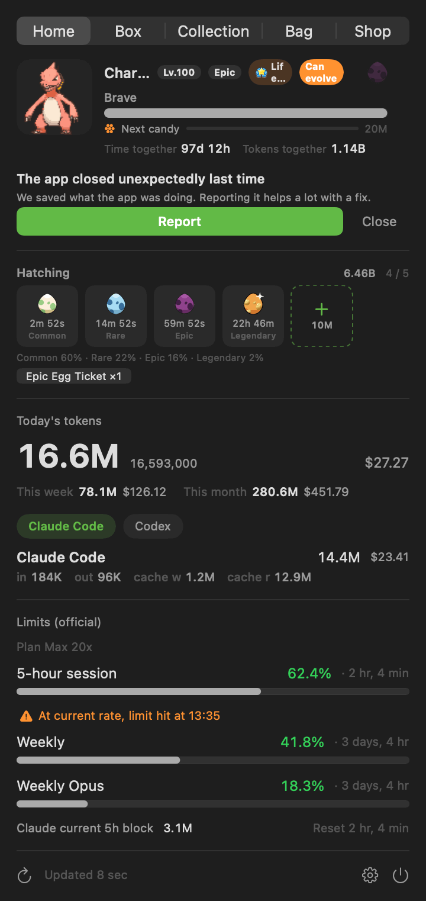
</div>

## How it works

1. 🎮 **Pick a starter.** On first launch, choose 1 of 27 first-stage Pokémon spanning Gen 1–9 (never shiny) — it becomes your partner.
2. 🪙 **Code as usual.** The tokens you burn in Claude Code, Codex, Gemini CLI, OpenCode, Hermes Agent, Cursor, or Grok CLI become spendable currency and feed your partner's experience at the same time — nothing extra to run.
3. 🥚 **Draw an egg.** Spend currency in the **Shop** for an egg of a randomly rolled grade — Common 60% / Rare 22% / Epic 15% / Legendary 3%, never chosen. A short reveal plays first: a white burst, plus a second in pale blue if it's Rare, a third in purple if Epic, and a fourth sparkling orange if Legendary — the number of bursts tells you the grade before the label does. Up to 3 eggs incubate at once, expandable to 6 with a slot upgrade.
4. 🐣 **Hatch on real time.** Commons are ready in 30 minutes, Rares in 2 hours, Epics in 6, Legendaries in 24 — real wall-clock time, even while the app is closed, with a single notification when it's ready. A ripe egg doesn't hatch itself: it waits in its slot, cracked, until you tap **Open** — that's what actually hatches a base (unevolved) species with real evolution data from [PokéAPI](https://pokeapi.co/), rolls one of 25 natures, and — once in a rare while — comes out **✨ Shiny**. Species with a regional look have a 20% chance to hatch as their Alolan, Galarian, Hisuian, or Paldean form instead — a look that individual keeps for life.
5. ⚡ **Evolve by hand.** Pokémon level from 1 to 100 on the games' own six experience curves, and evolve at the games' own levels — a Charmander becomes a Charmeleon at 16. Code (or feed EXP Candy) to level up, then tap to evolve once it's ready — branching lines let you pick the path, and a regional form can lead somewhere different (a Galarian Meowth evolves into Perrserker where a Kantonian one becomes Persian). A level alone isn't always enough: 56 branches want an evolution stone, 25 want a trade — stood in for by a Linking Cord, or by the item that trade would have held, like a Metal Coat — and others want time together. **Those items are never for sale.** A partner wearing a Ribbon brings back the one *it* needs, and once found it stays yours and works on every individual after it.
6. 📖 **Fill two collections.** The **National Dex** tracks every species you've ever hatched, #1 to #1025, with silhouettes for the rest. Your **Box** is a fixed 6×5 case you page through — new arrivals land at the end, and a slot stays put until you tidy — with partner, shiny, ribbon, and evolve-ready status carried by the sprite itself, its border, and its corner markers instead of a label. **Tidy** rearranges it once, by level, grade, Dex number, shiny, or Ribbon; sorting by when you got it puts everything back. Tap a cell to open a detail screen where you set your partner, feed candy, evolve, and change form. Duplicates are normal, and each individual keeps its own experience and evolution progress, so you can own both a Pidgey and a Pidgeotto at once.

## Tour

<table>
<tr>
<td width="45%" align="center">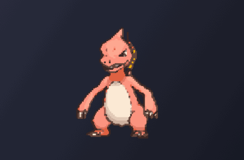</td>
<td width="55%" valign="middle">
<h3>🐾 Let it live on your desktop</h3>
Move your companion out of the menu bar and onto the desktop, at any size from 48 to 192px. Hover it for today's usage, click to open the popover, right-click for a menu, drag it wherever you like — and limit alerts can appear as a speech bubble above it.
</td>
</tr>
<tr>
<td width="55%" valign="middle">
<h3>In your menu bar</h3>
An animated Gen-V sprite lives next to today's total tokens (compact, e.g. <code>200.7M</code>). Add today's API equivalent (<code>$</code>) or official limit <code>%</code> — or turn everything off for a character-only bar.
</td>
<td width="45%" align="center"></td>
</tr>
<tr>
<td width="45%" align="center">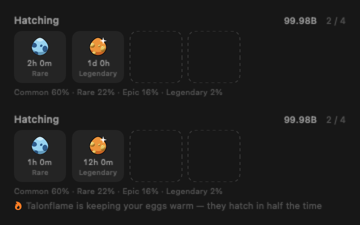</td>
<td width="55%" valign="middle">
<h3>A warm Pokémon in the box hatches eggs faster</h3>
Flame Body, Magma Armor and Steam Engine halve egg hatching in the games, and the 23 species that carry one of them do it here too. Owning any of them is enough — no need to keep it at your side. Whatever is already incubating loses half its remaining time the moment it arrives, and every egg after that starts at half. The hatching row says which Pokémon you have to thank.
</td>
</tr>
<tr>
<td width="55%" valign="middle">
<h3>Your partner brings you an Egg</h3>
Whoever is at your side fills an Egg of its own line — a Charizard brings a Charmander Egg, so the earlier stages you skipped can still fill in. It runs on its own meter, beside experience and untouched by it, so evolving costs the Egg nothing. Watch it fill on the home screen; when it is full it rocks, and pressing it drops the Egg straight into a hatching slot. It stops there until you take it, so there is never more than one waiting.
</td>
<td width="45%" align="center">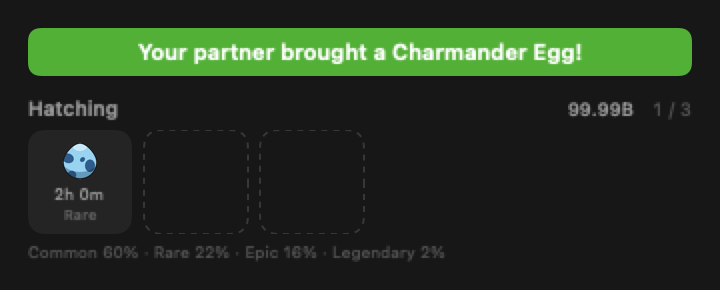</td>
</tr>
<tr>
<td width="45%" align="center">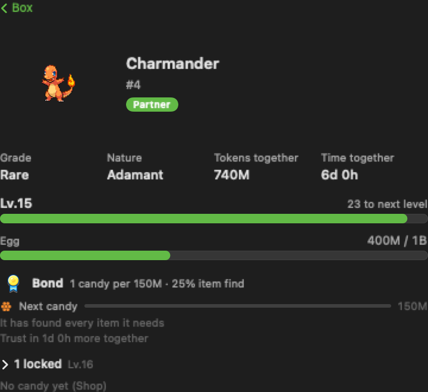</td>
<td width="55%" valign="middle">
<h3>Levels, the way the games do them</h3>
Experience is no longer a raw count of tokens. Every Pokémon has one of the games' six growth curves and levels from 1 to 100 along it, so a Slow-growing legendary really does take longer than a Caterpie. Evolution follows the games too — Charmander at 16, Charmeleon at 36 — and where an evolution needs a specific move, an item held at a certain hour, or a companion in your party, it is translated into something this app can actually offer.
</td>
</tr>
<tr>
<td width="45%" align="center">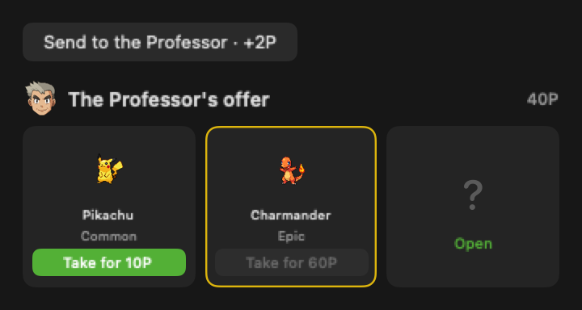</td>
<td width="55%" valign="middle">
<h3>Send what you don't need to the Professor</h3>
Pokémon you were never going to raise can go to the Professor, who pays in research points — more for the ones you did raise, so what you clear out is naturally the duplicates you left alone. Points are their own currency: they can't buy Eggs, and tokens can't buy from him. Every day he offers three Pokémon in exchange, leaning toward species missing from your Dex, and you can see exactly what each one is before you spend a point. Pick several at once in the Box; anything shiny or Legendary in the batch is called out by name and asked about twice.
</td>
</tr>
<tr>
<td width="55%" valign="middle">
<h3>Today's three arrive face down</h3>
The offers come covered, and you turn them over one at a time — each card opens where it sits, with rings that widen and colour by grade the way a hatching Egg does. Nothing about a card leaks before you open it, not even the gold ring a shiny wears. The three are yours alone: each save now rolls its own, so what the Professor holds out to you is not what he holds out to anyone else.
</td>
<td width="45%" align="center">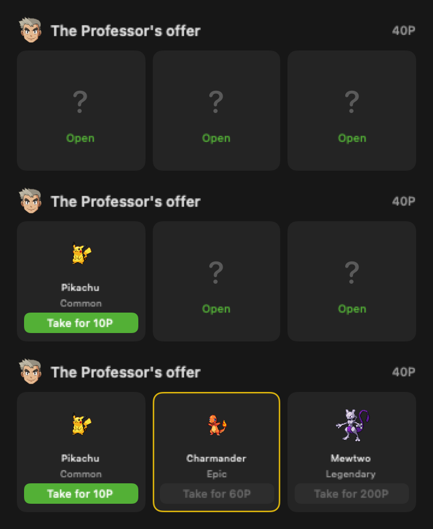</td>
</tr>
<tr>
<td width="55%" valign="middle">
<h3>Tidy the Box when it gets away from you</h3>
A Box fills in the order things arrived, which is fine until it isn't. <b>Tidy</b> rearranges it once — by level, grade, Dex number, shinies first, or Ribbon — and that arrangement is what stays. New arrivals still land at the end rather than slotting into place, so nothing shuffles under you while you work, and tidying by when you got them puts everything back exactly as it was.
</td>
<td width="45%" align="center">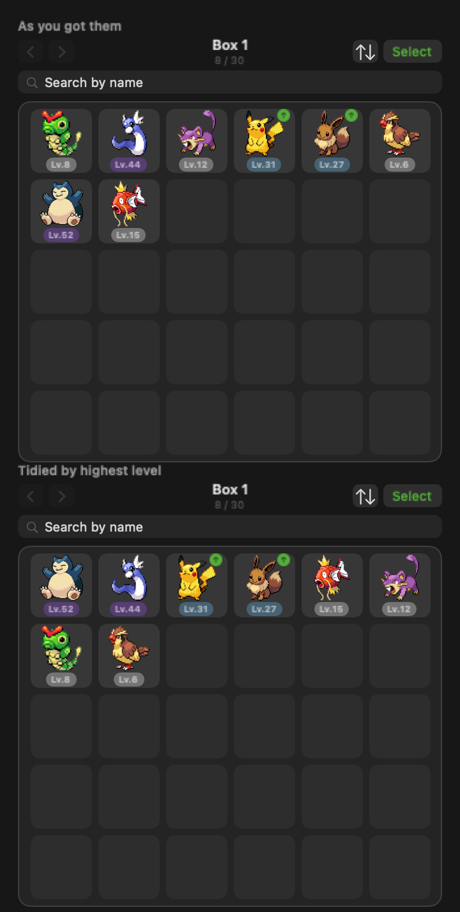</td>
</tr>
<tr>
<td width="55%" valign="middle">
<h3>Some change by who you keep close</h3>
Palafin turns Hero the way it does in the games — not when it comes out, but when it steps back. Put it at your side, swap someone else in, and it returns changed; swap again and it drops back. Terapagos is simpler: it wears its Terastal Form for as long as it is with you, and a Tera Orb takes it the rest of the way to Stellar.
</td>
<td width="45%" align="center">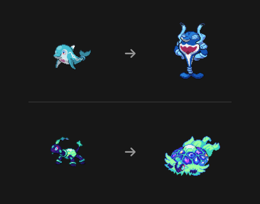</td>
</tr>
<tr>
<td width="45%" align="center"></td>
<td width="55%" valign="middle">
<h3>Born with a look of its own</h3>
Some species arrive already different. An Unown is one of 26 letters, a Flabébé one of five flower colours, a Shellos from the east or the west sea — decided at hatch and kept for life, through every evolution. A badge beside the number says which one you got.
<br><br>
Vivillon follows the region rule from the games: your Mac's country decides which of the 18 wing patterns it can be born with, and once in a while one turns up from somewhere else. Toxtricity needs nothing recorded at all — its form is read from the nature it hatched with, the same 13 and 12 natures the games split on.
</td>
</tr>
<tr>
<td width="45%" align="center">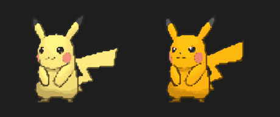</td>
<td width="55%" valign="middle">
<h3>✨ Once in a rare while — Shiny</h3>
Shiny hatches keep their distinct colors everywhere — menu bar, home card, evolution line, Box — through every evolution. A dedicated notification makes sure you don't miss the moment.
</td>
</tr>
<tr>
<td width="55%" valign="middle">
<h3>The sparkle, once</h3>
A shiny announces itself the way the games do: a single burst of gold around the sprite the moment it appears — when it hatches, and again each time you open it in the Box. One burst, then gone. A permanent glitter would be decoration, not a signal.
</td>
<td width="45%" align="center">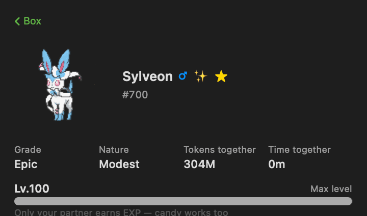</td>
</tr>
<tr>
<td width="55%" valign="middle">
<h3>The National Dex</h3>
The <b>National Dex</b> is a species checklist from #1 to #1025 — silhouettes until you've hatched one.
</td>
<td width="45%" align="center">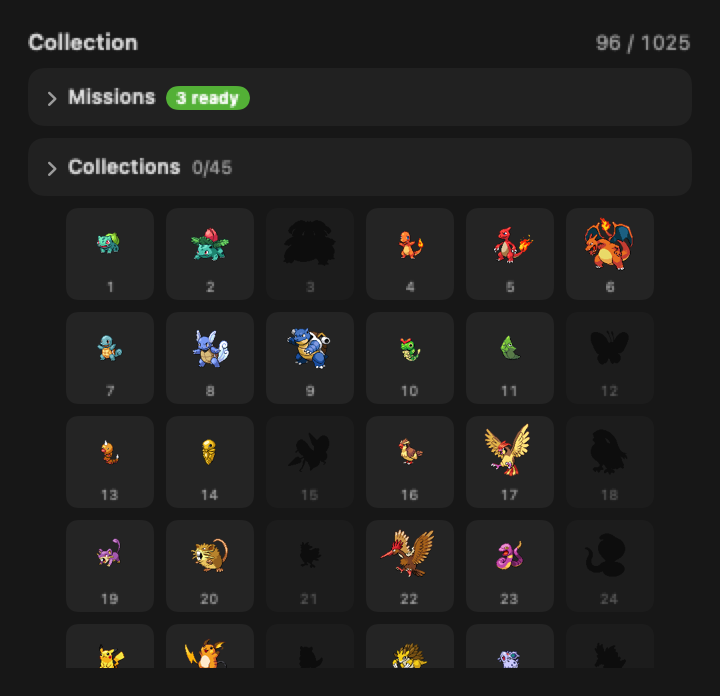</td>
</tr>
<tr>
<td width="45%" align="center">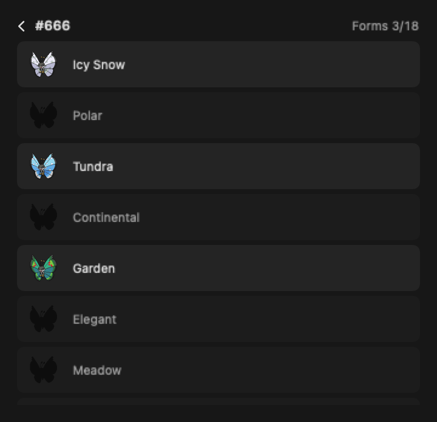</td>
<td width="55%" valign="middle">
<h3>Forms count separately</h3>
A species with more than one look — a regional form, or a pattern it's born with — opens into its own list from the <b>See forms</b> button on its Dex entry. Vivillon has eighteen patterns; Unown has twenty-six. Forms you've hatched show in colour, the rest stay silhouetted <b>but keep their names</b>, so you can see what's still out there rather than guessing. The species counter is unchanged: one of any form still fills the cell.
</td>
</tr>
<tr>
<td width="45%" align="center">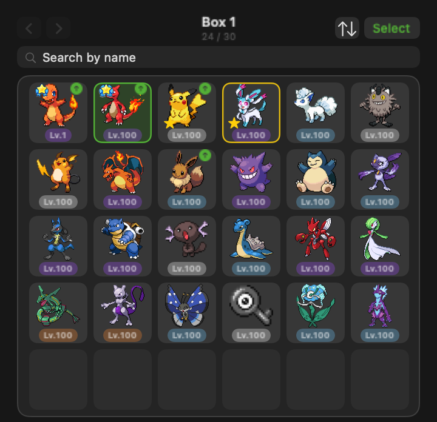</td>
<td width="55%" valign="middle">
<h3>Your Box</h3>
Your <b>Box</b> is storage, not a list: a fixed 6×5 case you page through with the header arrows — new arrivals land at the end, and a slot stays put until you tidy. <b>Tidy</b> rearranges it once, by level, grade, Dex number, shiny, or Ribbon; sorting by when you got it puts everything back. There's no per-slot label — the sprite, its border, and its corner markers carry partner, shiny, ribbon, and evolve-ready status. Sprites are trimmed to fill their slot evenly here (a toggle in Settings → Box); everywhere else the canvas is left alone, since it's what makes a Snorlax read bigger than a Diglett. Duplicates are completely normal.
</td>
</tr>
<tr>
<td width="55%" valign="middle">
<h3>A detail screen for every individual</h3>
Tapping a cell opens a detail screen with grade, nature, tokens and time spent together, its level and how far it is from the next one, its Egg meter, and Ribbon progress, plus the controls to set a partner, feed candy, evolve, or change form.
</td>
<td width="45%" align="center"></td>
</tr>
<tr>
<td width="45%" align="center">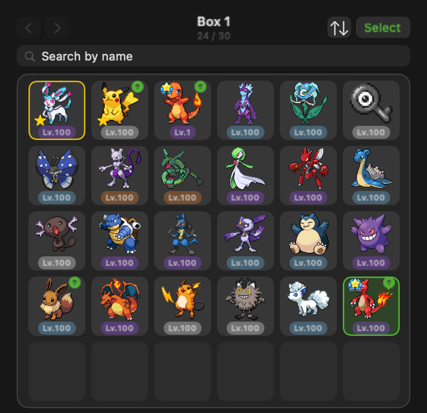</td>
<td width="55%" valign="middle">
<h3>⭐ Star the keepers</h3>
Star a Pokémon on its detail screen and it can't be sent to the Professor — the send button gives way to a note until you unstar it, and bulk-select skips it too. The star shows in its Box corner, and <b>Tidy</b> gains a <b>Starred first</b> sort so your keepers gather at the front. Borrowed whole from Pokémon GO's favorites: one mark that says both "mine" and "hands off".
</td>
</tr>
<tr>
<td width="55%" valign="middle">
<h3>🎯 The Dex pays you back</h3>
Filling the Dex now carries missions, shaped after the games: rewards at registration milestones (10 up to 1000 species), a reward for completing each generation's slice — Mega Stones for the Mega Evolution generations, Max Mushrooms for Kanto and Galar, Shiny Candy for the rest, always on top of a <b>Legendary Egg Ticket</b> — and, for the full 1025, the <b>Rainbow Charm</b>: 1/32 shiny odds on its own, granted even if you never bought the base charm, and it keeps improving your odds at every tier of the Shiny Charm after that. Tickets are the missions' egg currency: claimed into your Bag, they stand under the Shop's Draw button as a free draw with the grade guaranteed.
</td>
<td width="45%" align="center">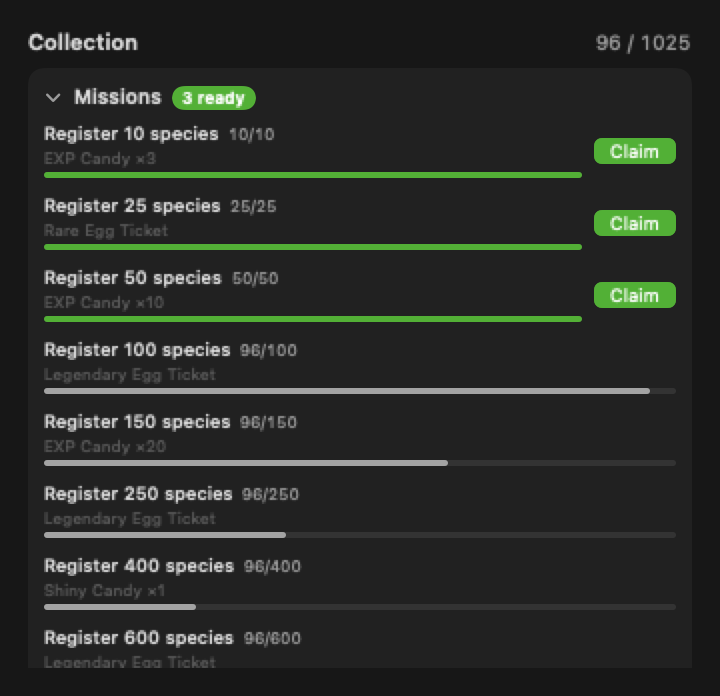</td>
</tr>
<tr>
<td width="45%" align="center">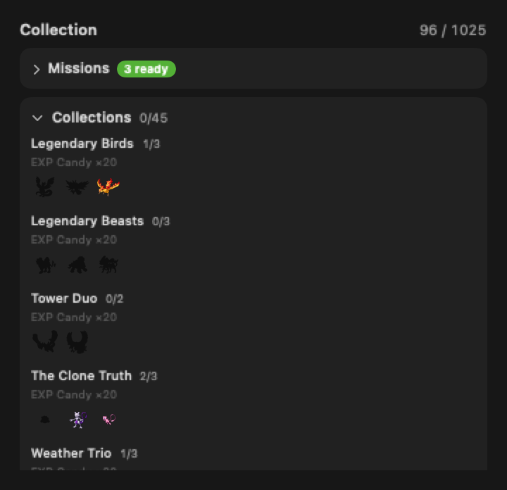</td>
<td width="55%" valign="middle">
<h3>🎖️ Collections tell the stories</h3>
Twenty-one themed sets sit beside the missions: the Legendary Birds, the Clone Truth (Mew, Mewtwo, Ditto), Eevee Friends, every fossil ever revived, the paradox Pokémon of past and future. Members always show as inline silhouettes, so what's missing is visible at a glance. Completing a set lights a medal on its row and pays once — EXP Candies for most, a guaranteed Legendary Egg Ticket for the big ones. The Regi family is special: gather the five pillars and <b>Regigigas itself awakens</b>, joining your Box directly — it never hatches from an egg, and shiny odds apply as usual.
</td>
</tr>
<tr>
<td width="55%" valign="middle">
<h3>📖 A Dex entry for every species</h3>
Tapping a Dex cell now opens that species' entry: sprite, genus, types, height and weight, and its flavor text — <b>from every generation it appeared in</b>, switchable by chips, in your language wherever the games shipped one. Collections it belongs to are listed right there with the shared member strip and its own spot highlighted, and the forms list opens from the same screen.
</td>
<td width="45%" align="center">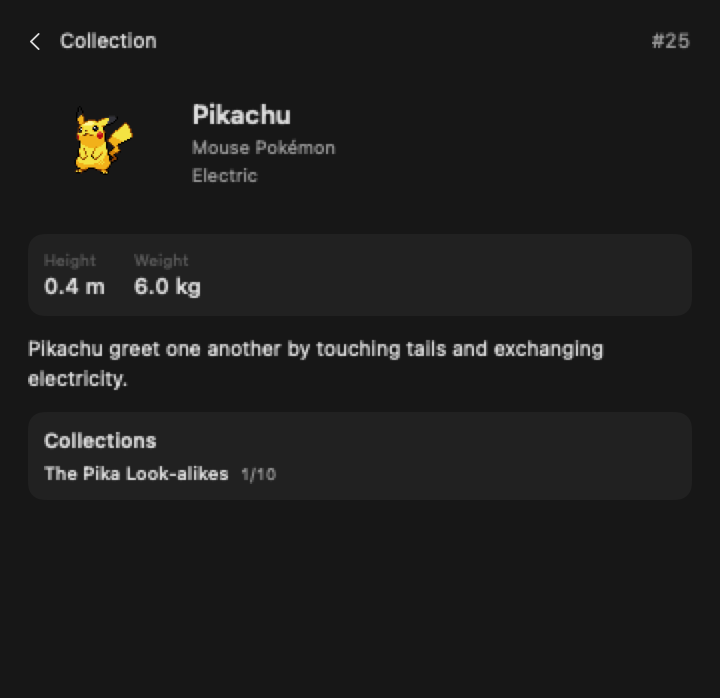</td>
</tr>
<tr>
<td width="45%" align="center">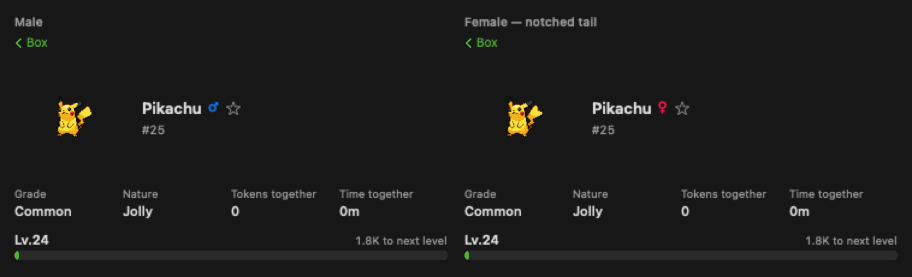</td>
<td width="55%" valign="middle">
<h3>♀ ♂ Every Pokémon has a gender</h3>
Gender is rolled once when an egg hatches, from that species' real ratio, and it never changes — evolution carries it, the way a regional form does. It shows beside the name on the detail screen. <b>98 species have a distinct female look</b> (Pikachu's notched tail, Hippopotas' colouring), and four the games treat as separate forms — Meowstic, Indeedee, Basculegion, Oinkologne — fill their own Dex entry. Gender also gates six evolutions exactly as the games do: only a female Snorunt becomes Froslass, only a male Ralts becomes Gallade.
</td>
</tr>
<tr>
<td width="45%" align="center">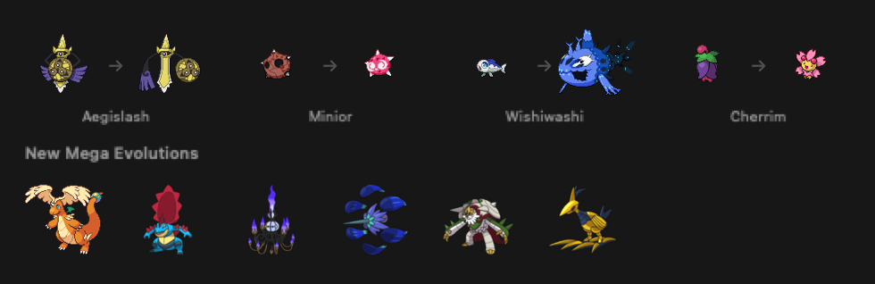</td>
<td width="55%" valign="middle">
<h3>🔄 More Pokémon change shape</h3>
Forms that only happen mid-battle in the games are carried onto things this app actually has. <b>Aegislash</b> draws its blade while you're burning tokens and raises its shield when you stop; <b>Morpeko</b> reads the same signal the other way and gets Hangry. <b>Cramorant</b> may come back holding a catch each time you make it your partner, and <b>Cherrim</b> blooms on a 20% roll. <b>Minior</b> and <b>Wishiwashi</b> join Mimikyu and Eiscue in reacting to three taps on the desktop pet. Eleven more species are born different — Pumpkaboo's size, Burmy's cloak, Squawkabilly's plumage, and rare finds like an Antique Sinistea. And <b>24 new Mega Evolutions</b> from Legends Z-A open with the Mega Stone you already have.
</td>
</tr>
<tr>
<td width="45%" align="center">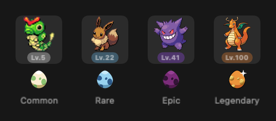</td>
<td width="55%" valign="middle">
<h3>Grades you can read at a glance</h3>
A Pokémon's grade used to mean opening it. Now the level label under each Box cell carries its colour — the same ladder the draw reveal and the hatching slots already use, so the shell you saw it come out of is the one on its cell. Common stays neutral; Rare, Epic and Legendary tint. Nothing else moves: the corners still belong to ribbons, evolution, stars and selection, and the border to shinies and your partner.
</td>
</tr>
<tr>
<td width="45%" align="center">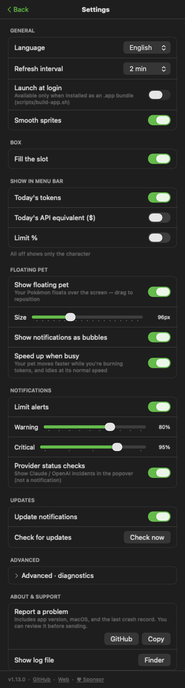</td>
<td width="55%" valign="middle">
<h3>Tune it your way</h3>
Menu-bar items, refresh interval (1–15 min or manual), launch at login, a Keychain opt-out that just hides the limits section, limit alerts with warning/critical thresholds, and hatch/evolution notifications. Full <b>KO / EN / JA</b> UI and Pokémon names.
</td>
</tr>
<tr>
<td width="55%" valign="middle">
<h3>🥚 Ready on the clock, opened by you</h3>
Draw up to 3 eggs at once (6 with a slot upgrade) — each grade gets its own shell colour and speckle count, so you can tell what's incubating at a glance. Every egg counts down on its own wall-clock timer — 30 minutes for a Common up to 24 hours for a Legendary — live on Home even while you're away, and a notification tells you once it's ready. It then waits there, cracked, until you tap Open — the cracked egg rocks, bursts, and the Pokémon springs out of it.
</td>
<td width="45%" align="center">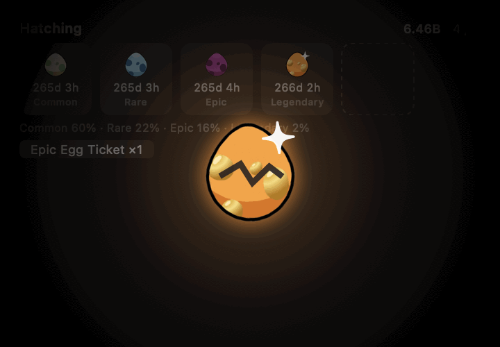</td>
</tr>
<tr>
<td width="45%" align="center">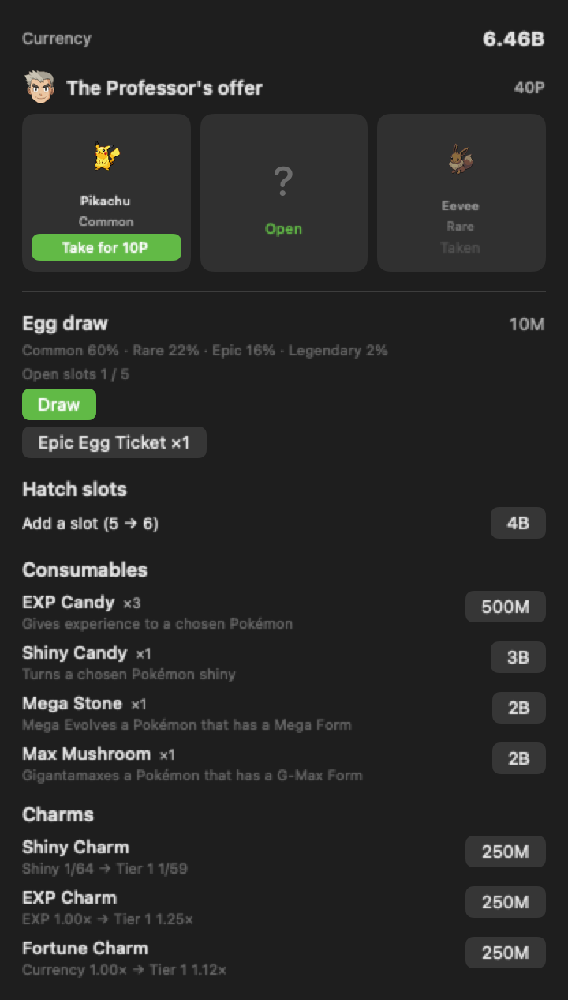</td>
<td width="55%" valign="middle">
<h3>🛒 A shop built for the economy</h3>
Every token you've already used is spendable currency. Draw eggs for 10M tokens with the odds shown right on the button, expand your incubator from 3 slots up to 6, buy <b>EXP Candy</b> to grow a Pokémon or <b>Shiny Candy</b> to make one shiny outright, or start climbing one of the three charms — the <b>Shiny Charm</b> for better hatch odds, the <b>EXP Charm</b> for experience from tokens and candy, the <b>Fortune Charm</b> for currency — each of which now has tiers rather than a single purchase. A <b>Mega Stone</b> or <b>Max Mushroom</b>, applied from a Pokémon's own detail screen, reshapes it into one of 80 catalogued forms. Evolution and form items are the shop's deliberate omission — those come from your partner.
</td>
</tr>
<tr>
<td width="55%" valign="middle">
<h3>🪜 Charms are a ladder, not a purchase</h3>
Each charm has tiers you keep climbing. A tier costs double the one below it while the effect grows by a fixed step, so every step you take costs twice as much per unit of benefit — there is no cap, because the price is the cap. Each row says what it raises, what it does now, and what the next tier would do. Anyone who already owned a charm keeps exactly the effect they paid for: the old one-shot charms land on tier 4, which is 2.00× experience, 1.50× currency, and 1/48 shiny — the same numbers as before.
</td>
<td width="45%" align="center">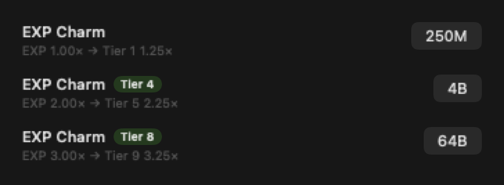</td>
</tr>
<tr>
<td width="55%" valign="middle">
<h3>🎗️ Ribbons turn time into candy — and into items</h3>
Keep the same Pokémon as your partner long enough and it earns a Ribbon — Bond at a day, Trust at a week, Kinship at a month, Lifelong at three months, each with its own badge. The tier doesn't buff that Pokémon directly; it sets how many tokens turn into one EXP Candy, from 150M down to 20M — and that candy can feed any individual in the Box, not just the partner. Every candy is also a chance for that partner to bring back an item **it** needs to evolve or change form, so the detail screen tells you what it's currently hunting for.
</td>
<td width="45%" align="center">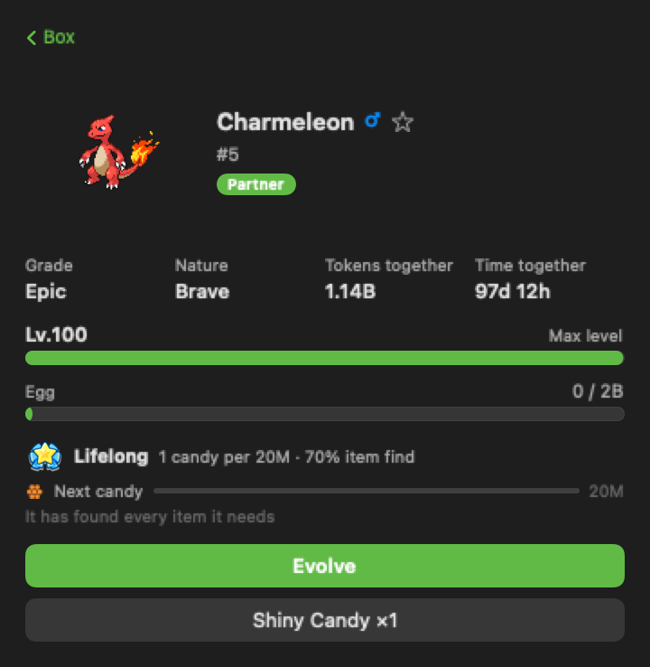</td>
</tr>
<tr>
<td width="45%" align="center">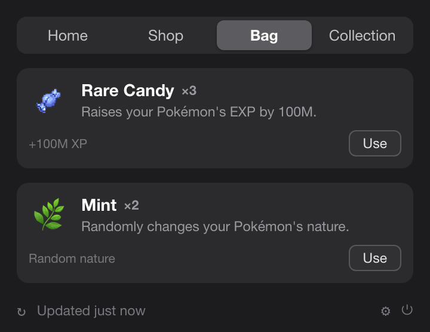</td>
<td width="55%" valign="middle">
<h3>🎒 A bag for what you've gathered</h3>
The shop sells seven things. The other 105 items only ever arrive in a partner's mouth, so the <b>Bag</b> is where you see what you hold: consumables with counts, charms with the tier they stand at, and two collections that show how far along you are — <b>41 evolution items</b> and <b>64 form items</b>. Nothing is used from here; every item belongs to a specific Pokémon, so you spend it on that Pokémon's own screen.
</td>
</tr>
</table>

## Also in the box

- **Interactive floating pet** — hover for today's usage, click to open the main window, right-click for a menu; limit alerts can pop up as speech bubbles. It also **moves faster while you're burning tokens** and idles at its normal speed (optional, on by default).
- **Per-service tabs** — when two or more of Claude Code, Codex, Gemini CLI, OpenCode, Hermes Agent, Cursor, and Grok CLI are detected, compact tabs switch between them; today's total stays combined.
- **Official limits** — Claude & Codex 5-hour / weekly utilization with reset countdowns, right under today's numbers.
- **Burn-rate forecast** — projects when the current 5h window hits 100%.
- **In-app updates** — one-click update check; current version shown in Settings.
- **Mega Evolution & Gigantamax** — a Mega Stone or Max Mushroom reshapes a chosen Pokémon into one of 80 catalogued forms (species with two Mega forms, like Charizard, offer both); reverting to normal is free, and evolving clears the form.
- **86 more forms** — Arceus's 17 plates and Silvally's 17 memories, Rotom's appliances, Genesect's drives, Ogerpon's masks, 15 Pikachu costumes and caps, and legendary transformations from Giratina Origin to Primal Groudon. Forms are the mirror image of evolution: evolution changes the species and can't be undone, while a form is the same individual wearing something else, so it reverts freely and its item is never spent.
- **Fusions** — Kyurem Black and White, Necrozma's Dusk Mane and Dawn Wings, and Calyrex's two riders need the partner species sitting in your Box. It isn't consumed: eating it would make a revertible form permanent.
- **Evolution conditions** — 56 branches need a stone, 25 need the item a trade would have held, and others need time together. None of them are sold; a ribboned partner finds the one it needs, and items are never spent, so the first Fire Stone serves every Vulpix after it.
- **Regional forms** — Alolan, Galarian, Hisuian, and Paldean variants can hatch instead of the original (20% chance for species that have one) and stay with that individual for life, sometimes changing what it evolves into; Mega and Gigantamax forms aren't available to them.
- **Ribbons** — keeping the same Pokémon as your partner for a day, a week, a month, or three months earns it Bond, Trust, Kinship, or Lifelong, each with its own badge; the tier sets how many tokens you spend before it produces one EXP Candy (150M down to 20M), and that candy can feed any individual in the Box, not just the partner. Each candy is also a roll for an item that partner needs.
- **Found it!** — when a partner turns something up, a card on Home names what it brought and opens item by item. Acknowledging it is never a gate: foraging runs on tokens, so a day of work counts whether or not you were watching.
- **Crash reports that name the culprit** — if the app ever quits unexpectedly, it keeps the last twenty things it was doing (which Pokémon you opened, which tab you were on) and offers to file a GitHub issue with them the next time you open the popover. Your home directory is stripped from the text, your save is never included, and nothing is sent until you press submit yourself.
- **Save integrity check** — hand-editing the save file is detected, not prevented: it marks the save permanently and turns every sprite upside down, but your progress is never discarded.

## Works with

| Tool | Tracked | Official limits |
|---|---|---|
| **Claude Code** | today · 5h block · week · month | ✅ 5h / weekly |
| **Codex** | today · week · month | ✅ 5h / weekly |
| **Gemini CLI** | today · week · month | — |
| **OpenCode** | today · 5h block · week · month | — |
| **Hermes Agent** | today · 5h block · week · month | — |
| **Cursor** | today · 5h block · week · month | — |
| **Grok CLI** | today · 5h block · week · month | — |

All read locally — no external usage CLI required. Adding a tool is one provider file (see [CONTRIBUTING.md](CONTRIBUTING.md)).

## Install

### Requirements

macOS 14+ (Apple Silicon or Intel). That's it — token usage is read directly from local Claude Code, Codex, Gemini CLI, OpenCode, Hermes Agent, Cursor, and Grok CLI data, with no external usage CLI required.

### Homebrew

```bash
brew install --cask donky-ey/tap/poke-dex-bar
```

ad-hoc/self-signed; the cask strips the quarantine attribute on install.

### Manual install (without Homebrew)

Prefer not to use Homebrew? Download `PokeDexBar.zip` from the [latest release](https://github.com/donky-ey/PokeDexBar/releases/latest), unzip it, and drag `PokeDexBar.app` into `/Applications`.

Because the app is ad-hoc/self-signed (not notarized under an Apple Developer account), Gatekeeper shows an "unidentified developer" warning on first launch. Clear it once, either way:

- **Finder:** right-click (or Control-click) `PokeDexBar.app` → **Open** → **Open** again in the dialog.
- **Terminal:** `xattr -dr com.apple.quarantine /Applications/PokeDexBar.app`

(The Homebrew cask strips quarantine for you, so it needs no extra step.)

### Build from source

```bash
swift build                  # debug
swift test                   # unit tests
./scripts/build-app.sh       # release → PokeDexBar.app → /Applications
```

## Data sources

| Source | Used for | Notes |
|---|---|---|
| `~/.claude/projects/**/*.jsonl` | Claude Code daily/blocks/weekly/monthly | read directly; deduped by message id; cached incrementally |
| `~/.gemini/tmp/**/chats/*.json(l)` | Gemini CLI daily/monthly | session records (`tokens` per message); weekly = daily sum |
| `~/.codex/sessions/**/*.jsonl` | Codex daily/monthly | `token_count` events; weekly = daily sum |
| `~/.local/share/opencode/opencode.db` | OpenCode daily/blocks/weekly/monthly | SQLite read-only; legacy `storage/message` JSON is also supported |
| `~/.hermes/state.db` | Hermes Agent daily/blocks/weekly/monthly | SQLite read-only; session token totals and persisted cost |
| `~/Library/Application Support/Cursor/User/globalStorage/state.vscdb` | Cursor daily/blocks/weekly/monthly | SQLite read-only; `cursorDiskKV` bubble entries with `tokenCount` |
| `~/.grok/sessions/**/updates.jsonl` | Grok CLI daily/blocks/weekly/monthly | `turn_completed` records (per-turn `usage`, server-reported cost); honours `$GROK_HOME`; subagent sessions are skipped because their tokens are already folded into the parent turn |
| Keychain / `~/.claude/.credentials.json` → `api.anthropic.com` | Claude official 5h/weekly % | unofficial endpoint; the Keychain is read **only when you press refresh** — auto-polling never reads it |
| `codex app-server` | Codex official 5h/weekly % | local child process; account snapshot only, no model turn |
| [PokéAPI](https://pokeapi.co/) — `pokeapi.co`, `graphql.pokeapi.co` | Pokémon species &amp; evolution data | runtime fetch; cached locally, never bundled |
| [Pokémon Showdown](https://play.pokemonshowdown.com/sprites/) — `play.pokemonshowdown.com` | Pokémon sprites (static &amp; animated, shiny, all generations) | runtime fetch; cached under Application Support, never bundled |
| `raw.githubusercontent.com/PokeAPI/sprites` | Item &amp; egg sprites | runtime fetch; cached under Application Support, never bundled |
| `status.claude.com`, `status.openai.com` | provider incident banner | statuspage summary; display only — turn it off in Settings |
| `api.github.com` | update check | latest release tag; on launch and when the popover opens |

## Privacy & permissions

- **On-device.** Token usage is read directly from local Claude Code, Codex, Gemini CLI, OpenCode, Hermes Agent, Cursor, and Grok CLI data. The app never uploads usage or runs model turns.
- **Outbound requests.** The app is not fully offline. It talks to eight hosts: `pokeapi.co` and `graphql.pokeapi.co` (species/evolution data), `play.pokemonshowdown.com` (Pokémon sprites), `raw.githubusercontent.com` (item &amp; egg sprites), `api.anthropic.com` (Claude official limits), `status.claude.com` and `status.openai.com` (incident banner — off switch in Settings), and `api.github.com` (update check). **None of them carry your usage, tokens, prompts, or project paths** — only the request itself.
- **Keychain (optional).** The Claude OAuth credential is read **only when you press a refresh button** (Settings, or the limits row in the popover). Automatic polling never touches the Keychain, so it never raises a password prompt; when available, the credential is taken from `~/.claude/.credentials.json` instead. The token is held in memory only — the app creates no Keychain item of its own. Once the token expires, limits stay visible but stale until you refresh. Turn it off in Settings — the limits section simply hides.
- **Pokémon assets** are fetched at runtime — species/evolution data from PokéAPI, sprites from Pokémon Showdown — and cached only under `~/Library/Application Support/PokeDexBar/`. The app binary and its release artifacts contain no Pokémon assets.

## Contributors

Contributions of all sizes are welcome — see [CONTRIBUTING.md](CONTRIBUTING.md) for how to build, test, and open a pull request.

[](https://github.com/donky-ey/PokeDexBar/graphs/contributors)

## License & disclaimer

**MIT** — see [LICENSE](LICENSE). The MIT license covers this project's original source code only; it grants no rights to any third-party trademarks, artwork, or data accessed through the app.

PokeDexBar is an **unofficial, non-commercial fan project**. It is **not affiliated with, endorsed, sponsored, or approved by Nintendo, Game Freak, Creatures Inc., or The Pokémon Company.** "Pokémon" and all related names, characters, and imagery are trademarks and copyrights of their respective owners. This project claims no ownership of, and asserts no rights over, any Pokémon intellectual property.

- **The app binary and its release artifacts bundle no Pokémon assets.** Pokémon species and evolution data are fetched **at runtime** from the public [PokéAPI](https://pokeapi.co); sprites are fetched **at runtime** from [Pokémon Showdown](https://play.pokemonshowdown.com/sprites/) (animated and shiny, all generations) — both cached locally on the user's own device. Sprite images remain the property of their respective owners.
- Any Pokémon imagery in this repository's documentation (screenshots/GIFs) is shown solely to illustrate the app's functionality.
- The app is provided free of charge for **personal, non-commercial use only.**
- If you are a rights holder with any concern about this project, please open an issue or contact the maintainer, and we will respond promptly.

*Provided "as is", without warranty of any kind. This notice is not legal advice.*
